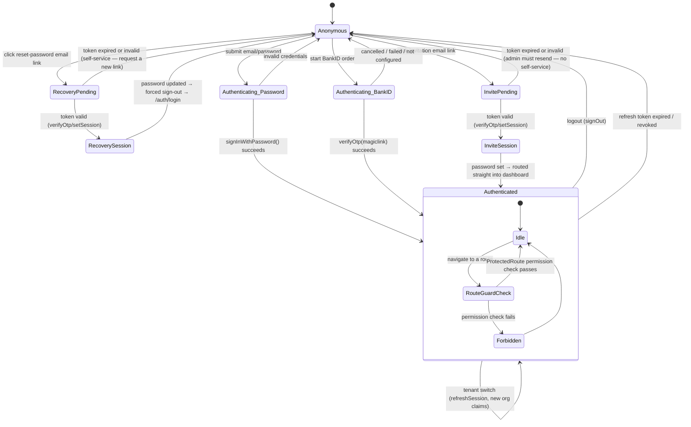

# Authentication Architecture

**Document type:** Architecture reference (authoritative).
**Produced by:** Sprint 4A — Authentication Architecture Review & Integration Validation.
**Status:** Reflects the implementation as of the Authentication Recovery Module (Sprint 4).

This is the single reference for how authentication works across this platform — every flow (password login, password recovery, invitation acceptance, BankID, logout, session refresh) is described here in terms of the *same* underlying session model, because that was the central finding of this review: there is one session model, not several, and every flow must integrate with it rather than build its own.

Related documents:

| Document | Relationship |
|---|---|
| `docs/EMAIL_ARCHITECTURE.md` | Owns the emails that carry recovery/invite links; this document owns what happens once the link is clicked |
| `docs/operational-runbook.md` §13 | Operational state of the SMTP dependency this flow relies on |
| `docs/ENTERPRISE_ARCHITECTURE_HANDBOOK_V1.0.md` | Platform-wide architecture this document is scoped beneath |
| `docs/CLAIMS.md` | The precise JWT claim schema (field-by-field contract) this document's session model produces and consumes — read that document for exact types/nullability, not this one |

---

## The Session Model

There is exactly one source of truth for "is this browser authenticated, and as whom": **`AuthProvider`** (`apps/web/src/app/providers/AuthProvider.tsx`), subscribed to Supabase's `onAuthStateChange`, writing into a single Zustand store (`useSessionStore`). Nothing else establishes or tracks a session independently — every flow's job is to get a real Supabase session onto the wire (via whichever Supabase Auth method fits that flow) and then get out of the way; `AuthProvider` takes it from there identically regardless of which flow produced it.

```
Supabase Auth (GoTrue) session change
          │
          ▼
AuthProvider.onAuthStateChange(event, session)
          │
          ▼
  parseJwtClaims() — organization_id, role, permissions,
  is_platform_admin all come from the JWT itself, not a
  follow-up query — authorization is available immediately
          │
          ▼
  useSessionStore.setSession(...)  ◄── single write path
          │
          ▼
  profile + organization loaded in background (non-blocking) —
  cosmetic data only; nothing authorization-relevant waits on it
```

Every flow's only real decision is **which Supabase Auth method produces the session**:

| Flow | Method that produces the session | Event fired |
|---|---|---|
| Password login | `signInWithPassword()` | `SIGNED_IN` |
| Password recovery | `verifyOtp({type:'recovery'})` or `setSession()` (link-format dependent — see below) | `PASSWORD_RECOVERY` or `SIGNED_IN` |
| Invitation acceptance | `verifyOtp({type:'invite'})` or `setSession()` | `SIGNED_IN` |
| BankID | `verifyOtp({type:'magiclink'})` | `SIGNED_IN` |
| Tenant switch | `refreshSession()` (new JWT, same user) | `TOKEN_REFRESHED` |
| Logout | `signOut()` | `SIGNED_OUT` |

**Finding closed during this review:** `AuthProvider` originally handled `INITIAL_SESSION` / `SIGNED_IN` / `USER_UPDATED` / `TOKEN_REFRESHED` / `SIGNED_OUT` — but not `PASSWORD_RECOVERY`. Supabase's own client fires `PASSWORD_RECOVERY` (not `SIGNED_IN`) specifically from `verifyOtp({type:'recovery'})` — confirmed by reading `@supabase/auth-js`'s `GoTrueClient.js` directly rather than assumed. Since `ResetPasswordPage` supports two link formats for the same logical flow (see below), and only one of the two happened to route through a handled event, the session model was silently un-unified: a recovery session would populate the store under one link format and not the other, for no reason connected to the actual flow. `AuthProvider` now treats `PASSWORD_RECOVERY` identically to `SIGNED_IN` — the fix is one condition, not new logic, and closes the only real "two flows, two behaviors" gap this review found.

### Why two link formats are supported for the same flow

Supabase Auth's email templates are Dashboard-only and unverifiable from this codebase. The *default*, unmodified template redirects with session tokens in the URL hash fragment (`#access_token=&refresh_token=&type=`); a customized template can instead use `?token_hash=&type=`. `apps/web/src/modules/auth/lib/authCallback.ts` handles both — `verifyOtp()` for the modern format (the same mechanism already established for BankID, not a new pattern), `setSession()` for the hash-fragment fallback — so the recovery and invitation callback pages work regardless of which template variant is actually configured live. This is deliberate redundancy against an unknown Dashboard state, not indecision.

---

## Authentication State Diagram



Notes on states that don't appear as separate boxes:

- **Email verification (signup confirmation):** not a reachable state today. There is no self-service signup in this platform — every account is created by an admin (`invite-user`) or platform bootstrap, with membership already provisioned. If self-service signup is ever added, it reuses this exact mechanism (`verifyOtp({type:'signup'})` fires `SIGNED_IN`, already handled) — no new session-model work, only a new entry point into `Authenticating_*`.
- **MFA (future):** not implemented. Supabase Auth's MFA (`mfa.challengeAndVerify`) fires its own `MFA_CHALLENGE_VERIFIED`-adjacent flow but still resolves to the same `session` object `AuthProvider` already consumes — adding it later means one more branch in `onAuthStateChange` treated like `SIGNED_IN`, not a parallel session mechanism. The architecture already accommodates it; nothing here needs to change in anticipation of it.
- **`RecoverySession` / `InviteSession`** are real Supabase sessions (not a distinct auth mechanism) — drawn separately here only because `AuthLayout` deliberately keeps the user on the password-set form instead of routing them into the dashboard the instant `isAuthenticated` becomes true, via a small path-based exemption (`/auth/reset-password`, `/auth/accept-invite`) rather than by branching on which event fired.
- **Multiple tabs:** Supabase's client persists the session to `localStorage` and listens for `storage` events, so a `SIGNED_IN`/`SIGNED_OUT` in one tab replays in every other open tab automatically — inherited from the SDK, not custom-built, and unchanged by this module.

---

## Design Principles Confirmed Consistent Across All Flows

1. **One session sink.** Every flow ends at the same `AuthProvider` → `useSessionStore` pipeline. No flow reads or writes session state through a side channel.
2. **Authorization comes from the JWT, not a follow-up query.** `organization_id`, `role`, `permissions`, `is_platform_admin` are all claims — available the instant a session exists, before profile/org data (cosmetic only) has loaded.
3. **Route protection is path- and permission-based, not event-based.** `ProtectedRoute` and `AuthLayout` both decide purely from `isAuthenticated`/`isLoading`/permissions in the store — never from "which event last fired," which is what makes the `PASSWORD_RECOVERY` gap safe to fix without touching either guard.
4. **Session issuance always goes through a real Supabase Auth primitive** (`signInWithPassword`, `verifyOtp`, `setSession`, `refreshSession`) — never a bespoke token or a hand-rolled cookie. This was true before this module (BankID) and remains true after it (recovery, invite).
5. **Edge Functions that mutate identity write to the same audit trail.** `recordIdentityEvent()` (`identity_security_events`, ADR-007) is the only writer — `invite-user` uses it exactly as `bankid-auth` and `auth-hook` already do, not a parallel logging mechanism.

---

## Known, Accepted Gaps (not blockers — documented, not silently ignored)

- **Password policy is client-enforced only.** `PasswordPolicySchema` (8+ chars, letter+number) runs in the browser before `updateUser()`/`inviteUserByEmail()`; Supabase Auth's own project-level minimum (Dashboard-configurable, unknown value) is the real floor a client bypassing the UI would hit. No server-side custom policy exists — adding one would mean a Dashboard-only Auth Hook, out of scope for this module.
- **CSRF:** not applicable in the traditional sense — every state-changing call in this module is a bearer-token API call (Supabase JS client, `Authorization` header), not an ambient-cookie form post. No CSRF token was added; none is needed for this request shape.
- **Edge Function gateway routing flakiness** (documented originally for BankID, ~50–60% single-attempt failure rate on freshly-deployed functions) applies to `invite-user` too, since it was deployed in the same sprint. Both callers now share one retry implementation (`shared/lib/edgeFunctionRetry.ts`) rather than each tolerating it independently.
- **Suspended membership produces no distinct error message.** `get_user_jwt_claims()` correctly excludes `status != 'active'` memberships when resolving the JWT (verified by reading the SQL directly), so a suspended account authenticates via GoTrue but ends up with `organization_id: null` — `AuthProvider` then calls `clearSession()` once the background profile load sees no org, bouncing them back to `/auth/login`. Not a security gap (permissions are correctly empty throughout), but the pre-written `login.error.account_suspended` copy is never actually shown — the user just sees a silent bounce with no explanation. Pre-existing (predates this module entirely, lives in the base login path, not the recovery/invitation code this module owns) — flagged in Sprint 4B validation, not fixed, since building real suspension detection is a login-flow enhancement, not a defect in what this module built.
