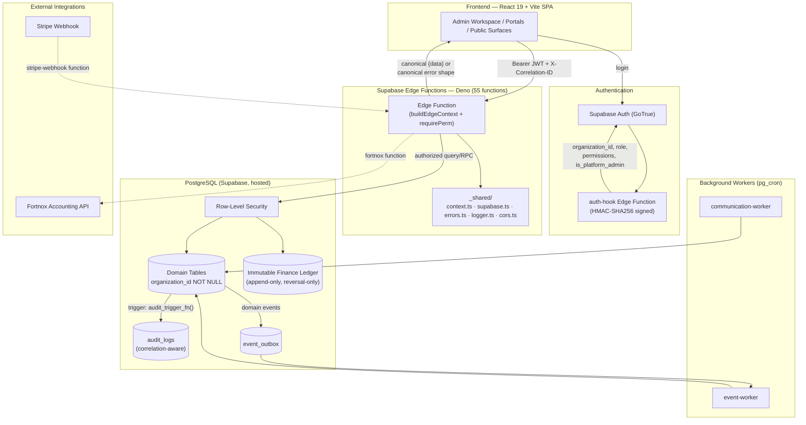
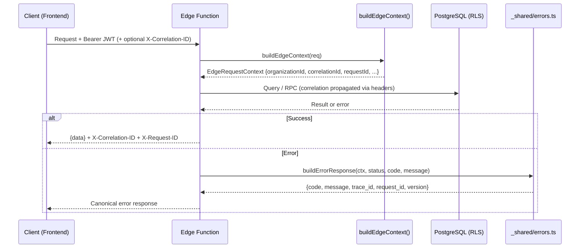

# TrafikskolaOS — Enterprise Architecture & Governance Handbook

**Document Type:** Permanent Enterprise Architecture & Governance Reference
**Version:** 1.0
**Status:** Established, Published
**Supersedes/Extends:** `BASELINE_v1.md` (2026-06-30, tag `v1.0-baseline`)
**Established by:** Production Readiness Epic PR-2 closure, 2026-07-09
**Audience:** All future engineers, architecture reviewers, code reviewers, release managers, and AI implementation assistants working on this repository

---

> **How to use this document.** This is the single authoritative reference for the platform's architecture and governance process as of Version 1.0. Before proposing, implementing, or reviewing any change, consult Section 5 (Constraints) and Section 9 (Future Development Guidelines). `BASELINE_v1.md` remains the detailed product/technical baseline snapshot from 2026-06-30; this handbook incorporates its binding decisions (BD-001–BD-010, P-001–P-020) by reference and extends them with the observability/error-schema architecture and governance process established through Production Readiness PR-2.

---

## Version History

| Version | Date | Authoritative Baseline | Major Changes | Approval Status |
|---|---|---|---|---|
| 1.0 | 2026-06-30 | `BASELINE_v1.md` (tag `v1.0-baseline`) | Initial enterprise baseline established: full product/technical architecture, `BD-001`–`BD-010`, `P-001`–`P-020` | Approved |
| **1.0 — PR-2 Completion** | 2026-07-09 | This handbook (supersedes `BASELINE_v1.md` as the primary architecture reference; `BASELINE_v1.md` remains the detailed product/technical snapshot it was built from) | Added observability & canonical error-schema architecture (`ADR-001`, `ADR-003`), 9-stage governance process, release-management standards, `P-021`–`P-023` | Approved |
| 1.0 — Documentation Enhancement | 2026-07-09 | This handbook, revised (this revision) | Added Version History, Stable/Operational content separation, Mermaid architecture diagrams, Table of Contents, Quick Reference, Reference Documents section, Future Documentation Governance section; no technical decisions changed | Approved |
| 1.0 — Platform Billing Entitlement Ownership | 2026-07-11 | This handbook, revised (this revision); Platform Billing Hardening Sprint | Added `ADR-004` classifying `max_users`/`max_locations` as Platform Billing commercial entitlements (not database integrity rules) and establishing that their PostgreSQL triggers are transactional safety guards only, never the owner of entitlement policy; added `P-024`; added a Technical Debt Register entry for the not-yet-implemented shared domain-policy module. Documentation only — no functional or database change made in this revision (the triggers themselves were implemented and deployed in the preceding Hardening Sprint). | Approved |
| 1.0 — Platform Administration UI Stability Pattern | 2026-07-11 | This handbook, revised (this revision); Platform UI Stability Hardening Sprint | Added `ADR-005` establishing that Portal-based UI components (Dialog, Sheet, AlertDialog, Drawer, Popover, and future equivalents) must always be mounted, with visibility controlled exclusively via `open`, platform-wide; added `P-025`; added a "How to build Portal-based UI" entry to Section 9 with an explicit code-review rejection rule for conditionally-mounted Portal components. Documentation only — no functional, component, or route change made in this revision (the pattern itself was implemented and verified live in the preceding Hardening Sprint). | Approved |
| 1.0 — Finance Subscription Entitlement Enforcement | 2026-07-12 | This handbook, revised (this revision); Production Readiness Sprint 2 | Added `ADR-006` establishing `FEATURE_GATES` (`_shared/subscription.ts`) as the sole authoritative source of Finance subscription-tier policy, Edge Functions (`requireFeature()`) as the enforcement point and source of truth, and the frontend `SubscriptionGate` component as a UX-only counterpart that must never make an independent entitlement decision; added `P-026`; added a "How to enforce Finance subscription entitlements" entry to Section 9. Documentation only — no functional, Edge Function, or component change made in this revision (the enforcement itself was implemented and deployed in the preceding Production Readiness Sprint 2). | Approved |
| 1.0 — Identity & Security Architecture | 2026-07-12 | This handbook, revised (this revision); Identity & Security Architecture design program | Added `ADR-007` establishing the Identity & Security Architecture: Identity State (`auth.users`, `profiles`, `auth_identity_links`) vs. Identity History (`identity_security_events`) as permanently separate concerns, the six-domain Identity Ownership Matrix (Authentication / Identity / Authorization / Identity & Security Events / Audit Logs / Event Outbox), BankID as the second authentication provider alongside email/password, and the Single-Source-of-Truth rule for all future identity providers; added `P-027`; added a "How to integrate a new identity/authentication provider" entry to Section 9; added companion documents `IDENTITY_RETENTION_STRATEGY.md` and `IDENTITY_SECURITY_ROLLBACK_STRATEGY.md`. Documentation only — architecture and implementation blueprint approved and frozen; Phase 1 implementation has not yet begun. | Approved |
| 1.0 — Identity Event Taxonomy Frozen | 2026-07-12 | This handbook, revised (this revision); Phase 1 Implementation Audit | Formalized the canonical `identity_security_events.event_type` naming standard as companion document `IDENTITY_EVENT_TAXONOMY.md`, referenced from `ADR-007`: provider-neutral events (`login.success`, `login.failed`, `identity.linked`, `identity.unlinked`, etc.) always pair a canonical name with the `provider` column; a provider-specific event name is permitted only for behavior with no equivalent under any other provider (BankID's async `authentication_started`/`authentication_cancelled`/`signature_started`, and — as a deliberate, revisitable exception — BankID's signature terminal outcomes, since e-signature has exactly one provider on the roadmap today). Corrected `logout` to `session.logout`, the only taxonomy entry that failed Phase 1's deployed `event_type` format constraint. Documentation only — no schema or code change; the Phase 1 table, indexes, RLS, and permissions are unmodified and remain frozen. | Approved |
| 1.0 — Identity Event Writer Contract | 2026-07-12 | This handbook, revised (this revision); Phase 2 Governance Refinement | Formalized the mandatory Identity Event Writer Contract as companion document `IDENTITY_EVENT_WRITER_CONTRACT.md`, referenced from `ADR-007`: confirmed the shared writer (`recordIdentityEvent()`, `_shared/identity-events.ts`) already exists and is already the sole write path (verified — exactly two callers, both Password Authentication's Phase 2 writers, no duplicated insert logic anywhere), so no extraction is required before BankID; documented the mandatory/when-available/optional event field contract, restated the metadata and correlation rules as hard requirements on every writer (not only naming convention), and recorded two honest, non-blocking gaps (no distinct `actor_id` separate from `user_id`; `correlation_id` optional in the type signature despite universal current use) as future refinement items, not Phase 3 blockers. Documentation only — no schema, taxonomy, or implementation change; Phase 1 and Phase 2 remain exactly as deployed and verified. | Approved |
| 1.0 — Phase 3 BankID Integration & Delivery Status | 2026-07-12 | This handbook, revised (this revision); Phase 3 BankID Authentication Integration | Phase 3 implemented and deployed: `auth_identity_links`/`bankid_auth_orders` tables, `_shared/bankid-crypto.ts` (new AES-256-GCM/HMAC-SHA256 implementation — the personnummer encryption pattern ADR-007 assumed reusable was found, on live verification, to be schema-only and never actually populated anywhere in the existing codebase), `_shared/bankid-client.ts` (real BankID v6.0 REST client, mTLS-gated), `bankid-auth` Edge Function (login + link purposes), frontend BankID login option; reused the Identity Event Writer/Store/taxonomy verbatim, zero duplication. A Root Cause Analysis conclusively isolated an intermittent gateway-level 404 to a Supabase platform/deployment-recency characteristic (proven via direct ablation — a zero-BankID-code diagnostic function reproduced the identical failure rate — and an interleaved live control), not an application defect; mitigated client-side with a 4-attempt retry. Added the permanent **Delivery Status** section, establishing the three-stage Development Complete / Operational Acceptance / Production Release lifecycle for all future phases, and classified Phase 3 against it: Development Complete ✓, Operational Acceptance Pending External Dependencies (BankID relying-party certificate), Production Release Not Yet Released. No architecture, schema, taxonomy, or roadmap change in this revision. | Approved |
| 1.0 — Operational Governance Baseline | 2026-07-13 | This handbook, revised (this revision); Production Readiness Sprint 4 (Student & Guardian Portal) | Sprint 4 shipped Student/Guardian Portal stabilization (Hidden/Production Defect items only, per the approved scope) and, during its own browser verification, hit a self-inflicted live authentication regression: redeploying `student-portal`/`guardian-portal` via `supabase functions deploy` without `--no-verify-jwt` silently reset gateway `verify_jwt` from `false` to `true`, rejecting all portal-token authenticated requests before application code ran (`/validate` alone survived, since it authenticates via the anon key). Fixed by redeploying both with `--no-verify-jwt`; zero application/session/architecture code changed. Root cause was evidence-scoped: the observed correlation (bare deploy → `verify_jwt` reset, reproduced twice, `config.toml`'s per-function setting not honored either time) was documented as *observed behavior*, explicitly distinguished from an unverified claim about Supabase CLI internals. Added the permanent **Operational Governance** section — "Live Deployment State is Authoritative," the Deployment Governance rule, the Operational Verification Standard (Deployment → Live Configuration Verification → Authentication Verification → Browser Verification → Production Readiness Verification → Sprint Closure), the Edge Function Authentication Verification checklist, the `verify_jwt` architecture rule, and the Operational Governance Baseline freeze (future changes to this section require an ADR). No schema, authentication architecture, or roadmap change in this revision. | Approved |
| 1.0 — Finance Module RBAC Enforcement | 2026-07-14 | This handbook, revised (this revision); RBAC Stabilization Sprint 5 | Closed a frontend RBAC coverage gap across the Finance module, distinct from and additional to `ADR-006`'s subscription-tier enforcement: several Finance route pages performed no `PermissionGate` check at all (`FinanceOverviewPage`, `InvoiceListPage`/`InvoiceDetailPage` page-level, `PaymentListPage`, `KassaPage`, `OrderListPage`/`OrderDetailPage`), relying solely on sidebar nav filtering — reachable and fully functional via direct URL for any authenticated user regardless of role. Most notably, `BankReconciliationPage` had a `SubscriptionGate` (tier check) but zero `PermissionGate` (role check) despite its own error copy already referencing `finance:reconciliation:read`, a latent gap masked in practice by trial-tier tenants being denied by the subscription check first. Closed using only pre-existing, already-role-mapped permissions (`finance:invoice:read`, `finance:payment:read`, `finance:invoice:create`, `finance:payment:create`, `finance:reconciliation:read`, `finance:reconciliation:manage`, `orders:order:read`, `orders:order:update`, `orders:order:cancel`) and the existing `PermissionGate`/`SubscriptionGate` nesting order already established in `JournalbokenPage`/`MomsperioderPage`/`SIE4ExportsPage`/`FinancialClosePage` (`SubscriptionGate` outer, `PermissionGate` inner) — no new permission, no new gating component, no new pattern. `KassaPage` (a combined invoice-create + payment-create checkout flow) is gated with `PermissionGate`'s existing `allOf` mode rather than a single permission, since it genuinely requires both. `PackageListPage`/`CampaignListPage`/`JournalbokenPage`/`MomsperioderPage`/`FinancialClosePage`/`SIE4ExportsPage` were audited and found already fully compliant — untouched. Live-verified: `instructor` (no Finance/Orders permissions) blocked on every named page via direct URL; `finance_admin` (full Finance access, no `orders:*`) correctly retains Finance access while being blocked from `/orders`, confirming the cross-domain boundary; `org_owner` retains full access. No database, migration, role-mapping, accounting, VAT, invoice, or payment-workflow change in this revision. | Approved |
| 1.0 — Person Lookup Framework (Student Registration Intelligence) | 2026-07-14 | This handbook, revised (this revision); Sprint 6 | Approved as an explicit, named exception to the Version 1.0 Feature Freeze (a core business workflow completion, not a new product surface). Added `ADR-008` establishing the **Person Lookup Framework** — a `PersonLookupProvider` interface (`getProviderName`, `getProviderCapabilities`, `validateConnection`, `lookupByPersonnummer`) implemented in `supabase/functions/_shared/person-lookup.ts`, with a fixture-backed Mock Provider as the only Version 1.0 implementation (no live provider, no SPAR integration). Student Registration's previously-disabled lookup button is now wired end-to-end: format-validate (reusing `isValidPersonalNumber`) → lookup → pre-fill `StudentForm` → receptionist reviews/edits → save. No lookup result is persisted; only what the receptionist explicitly confirms on save reaches the database, through the pre-existing, unmodified `handleCreate`/duplicate-detection path (enriched only to return `existing_student_id` so the UI can offer to open the existing record instead of silently failing). No new permission, no new database table/migration, no new Edge Function — the new route lives on the existing `students` function. Explicitly distinguished in the ADR text from `ADR-007`'s unrelated "Identity" (authentication) domain to prevent future naming confusion. | Approved |
| 1.0 — Person Lookup Framework Quality Review | 2026-07-14 | This handbook, revised (this revision); Sprint 6 quality review | `ADR-008` corrected, no new pattern introduced. Fixed 5 internally-inconsistent Mock Provider fixtures in `_shared/person-lookup.ts`: each entry's `gender` field already correctly matched the Luhn-encoded gender digit of its own personnummer key, but `first_name` did not match that gender (e.g. a `gender: 'male'` entry named "Anna") — corrected by reassigning `first_name` only; personnummer keys, `gender`, `date_of_birth`, and addresses were already correct and untouched. Replaced provider-specific UI text with provider-neutral wording in `StudentForm.tsx`: the lookup button ("Sök i Statens personadressregister" → "Hämta personuppgifter") and its helper text (no longer names "folkbokföringen"), so the UI reads correctly regardless of which provider is configured. Confirmed (no interface change) that `PersonLookupProvider`'s two network-bound methods (`validateConnection`, `lookupByPersonnummer`) remain `Promise`-based and sufficient for a future live provider; documented why `getProviderName`/`getProviderCapabilities` are correctly synchronous metadata accessors, not an oversight. Documented per-tenant provider configuration as deferred **Version 1.1+** work in `VERSION_1.1_ROADMAP.md` (Technical Debt Section 3 and Integrations Section 4), cross-referenced from `ADR-008`. No functional change to the lookup flow, the duplicate-detection path, or any permission. | Approved |
| 1.0 — External Services Hub Refinement | 2026-07-14 | This handbook, revised (this revision) | Added `ADR-009` establishing the **External Services Hub** (`/settings/external-services`) as the single authoritative entry point for third-party integrations, organized into four business-oriented categories (Identity Services, Communication, Accounting, Scheduling) plus a reserved, empty Future Integrations section. Standardized every integration card on one shared `IntegrationCard` component and a fixed five-value status vocabulary (`connected`/`not_connected`/`platform_managed`/`coming_soon`/`unknown`). Extracted the previously page-local Fortnox OAuth status query into a new, shared `apps/web/src/modules/finance/hooks/useFortnoxStatus.ts` (`FortnoxPage.tsx` now imports it too — duplication removed, not added). SMS/Email and Fortnox cards now show real, live-queried status (reusing `useChannelConfigs()` and the new `useFortnoxStatus()`, unmodified underlying data models); BankID remains informational-only and explicitly `platform_managed`. Visma reclassified into the Accounting category as `coming_soon` ("planerat för Version 1.1"); Google Calendar and Microsoft 365 grouped into a new Scheduling category, also `coming_soon`. No new database table, permission, or Edge Function route. Verified live at desktop/tablet/mobile viewports and against a genuine trial-tier `402` (subscription-gated) response, confirming honest `unknown`-status degradation rather than a fabricated value. | Approved |
| 1.0 — External Services Hub Status Model Standardization (Sprint 6A) | 2026-07-14 | This handbook, revised (this revision); Sprint 6A | `ADR-009` corrected, no new pattern introduced: replaced the catch-all `unknown` status with two distinct values — `subscription_required` (a business restriction; HTTP 402) and `unknown_error` (an unexpected technical problem; 401/403/404/5xx/network failure) — so the hub never presents a subscription restriction as a failure. Added the single shared mapping function `resolveIntegrationStatusError()` (`apps/web/src/shared/lib/integrationStatus.ts`) that every status-bearing card now calls, replacing three separate ad hoc `isError ? 'unknown' : ...` computations; corrected `apiPersonLookupStatus()` (`ADR-008`) to throw the raw error instead of a stringified message, since the mapping function needs the real HTTP status. Extended `IntegrationCard` with two additive, backward-compatible props — `loading` (a neutral "Hämtar status…" badge during the first fetch, so a slow network never flashes a false error) and `statusMessage` (a user-safe explanation shown only for `subscription_required`/`unknown_error`) — no visual redesign of the card shell, no change to the four business categories or any `coming_soon`/`platform_managed` card. Verified live against a genuine trial-tier `402` (`subscription_required`) and a genuine professional-tier `200` (`not_connected`); verified `unknown_error` (401/403/404/500/network-timeout) via Playwright route interception against the Person Lookup status endpoint — a client-side network mock, no backend or subscription logic modified. No database change, no new permission, no new Edge Function route. | Approved |
| 1.0 — Pilot Readiness Assessment & Scope Freeze (Action 0) | 2026-07-14 | This handbook, revised (this revision); Version 1.0 Pilot Readiness Assessment | An evidence-based, read-only assessment of the current repository (not assumed from prior approvals) found the platform's core workflows sound but surfaced 2 Critical authorization gaps (`guardian-portal` and `data-migration` Edge Functions permit PII-bearing actions with no role check), 6 High findings (≈264 uncommitted changed paths spanning entire never-committed modules including `bankid-auth`; dormant `personnummer_hash` duplicate detection; a silently-failing dunning/reminder dispatch; the confirmed-still-live `compliance/index.ts` undefined `ok()` defect, Section 12; no frontend error tracking; the `verify_jwt` deploy-drift risk, Operational Governance section, previously reproduced with no automated gate), and a long tail of Medium/Low findings — Pilot Readiness Score 58%, Final Recommendation "Ready for Internal Testing — Not Yet Ready for Friendly or Commercial Pilot." Added the **Version 1.0 Scope Freeze — Pilot Governance** subsection to Section 5: remaining Version 1.0 work is limited exclusively to the 9-item Pilot Readiness Action Plan (Action 0, this entry, through Action 8); a mandatory 3-way classification rule (Pilot Blocker / Commercial Release Enhancement / Version 1.1 Backlog) for any newly-identified work; a 5-level decision hierarchy (this Handbook → ADRs/ACRs → this Scope Freeze → the Action Plan → the current sprint objective); and an explicit note that `VERSION_1.1_ROADMAP.md`'s 2026-07-09 "READY TO BEGIN VERSION 1.1" recommendation is superseded until this freeze lifts. No application code, database, or Edge Function was modified — this is a governance and documentation action only, per its own DO NOT list. | Approved |
| 1.0 — Compliance Runtime Fix (Action 4) | 2026-07-14 | This handbook, revised (this revision); Pilot Readiness Action Plan | Resolved the High-priority runtime defect tracked in Section 12: `compliance/index.ts` called an undefined `ok()` at 31 call sites (all in its Phase 6A/6B replay CI/CD and validation-suite routes) — a confirmed live `ReferenceError`, since `ok` was neither imported nor defined anywhere in the file. Fixed by defining `ok<T>(ctx, data, status = 200)` alongside the file's existing `err(ctx, ...)` helper, delegating to `buildSuccessResponse()` (`_shared/errors.ts`) exactly as `err()` already delegates to `buildErrorResponse()` — the same canonical ADR-003 pair, not a new abstraction. All 31 call sites (verified: every one was the identical `return ok(data);`, all within `ctx`'s closure in the single main router function) were updated to `return ok(ctx, data);`; response body shape (`{data: ...}`) and status code (200, matching every existing call site) are unchanged — only the correlation/request-ID headers are newly present, an additive consequence of using the canonical helper, not a schema change. Live-verified: `GET /compliance/validate/phase6b` (one of the 31, previously guaranteed to throw) now returns `200` with the correct `{data: {...}}` envelope and `X-Correlation-ID`/`X-Request-ID` headers, executing its full RPC (`run_phase6b_validation_suite`, 20/20 tests passed) end-to-end; `GET /compliance/validate/phase6a` (a separate, never-broken route using its own `json()` return) still correctly returns `403 FORBIDDEN` via the unchanged `err()`/`buildErrorResponse()` path, confirming no regression to error handling or RBAC. Deployed with unchanged `verify_jwt = true` (explicit `config.toml` entry, confirmed unchanged post-deploy — no dual-auth-model routes on this function, no regression risk of the kind hit in Action 2). No business logic, RBAC, audit, multi-tenancy, or API contract change. | Approved |
| 1.0 — Student Duplicate Detection Hardening (Action 5) | 2026-07-14 | This handbook, revised (this revision); Pilot Readiness Action Plan | Resolved the High-priority data-integrity defect tracked since Sprint 6/ADR-008 and restated in the Pilot Readiness Assessment: `students/index.ts`'s duplicate-personnummer check only ran `if (dto.personnummer_hash !== undefined)`, but the frontend never computed or sent that field — the check was permanently dead code, so a student could be registered twice under the same personnummer with no detection. Fixed by computing `personnummer_hash` **server-side**, unconditionally, in both `handleCreate` and `handleUpdate`, whenever a request supplies both `date_of_birth` and `personnummer_last4` — reconstructing the canonical 12-digit personnummer and hashing it with the existing generic HMAC-SHA256 helper `hashPersonalNumber()` (`_shared/bankid-crypto.ts`, `IDENTITY_HASH_KEY` — the same primitive already used for `auth_identity_links.external_subject_hash`; reused as-is, not duplicated) — any client-supplied `personnummer_hash` is now overwritten, so detection is fully independent of client behavior. `date_of_birth` is already normalized to ISO `YYYY-MM-DD` by the existing (unmodified) frontend parser regardless of which raw format — `YYYYMMDD-XXXX`, `YYMMDD-XXXX`, `YYMMDD+XXXX`, etc. — a receptionist originally typed, so the server-side reconstruction is format-agnostic by construction; the frontend's own Zod validation (unmodified) currently only accepts the 4-digit-year, optional-hyphen form, a pre-existing, separate constraint not touched here. `identityCryptoConfigured()` guards the computation — if `IDENTITY_HASH_KEY` were ever unset, hash computation is skipped (logged) rather than the request failing, preserving graceful degradation. Live-verified: two students created with identical `(date_of_birth, personnummer_last4)` and no client-supplied hash — the second is correctly rejected `409 DUPLICATE_PERSONAL_NUMBER` with `details.existing_student_id`; a distinct personnummer and a student with no personnummer both create successfully (no false positives); updating one student's personnummer to collide with another's is also correctly rejected via the same mechanism in `handleUpdate`. Response schema, error codes, RBAC (`students:student:create`/`update`, unchanged), audit logging (`Student.Created`/`Student.Updated`, unchanged), and tenant isolation (`organization_id` scoping, unchanged) are all identical to before. Deployed with unchanged `verify_jwt = true`. No database, migration, new permission, or Student Registration workflow change. | Approved |

Future versions should append a new row here rather than overwrite prior entries. A version increment (e.g. `1.1`) is warranted when a new ADR is accepted or a Section 5 constraint changes; a documentation-only pass (like this one) stays at the same version number with a new dated row.

---

## Table of Contents

**Front Matter**
- [Version History](#version-history)
- [Quick Reference](#quick-reference)

**Part I — Stable Architecture** *(changes rarely; governed by Section 14)*
- [1. Executive Summary](#1-executive-summary)
- [2. Enterprise Architecture](#2-enterprise-architecture)
- [3. Architecture Decision Records](#3-architecture-decision-records)
- [4. Governance Standards](#4-governance-standards)
- [5. Version 1.0 Constraints](#5-version-10-constraints)
- [6. Release Management](#6-release-management)
- [7. Repository Standards](#7-repository-standards)
- [8. Technical Standards](#8-technical-standards)
- [9. Future Development Guidelines](#9-future-development-guidelines)
- [Delivery Status](#delivery-status)
- [Operational Governance](#operational-governance)

**Part II — Operational Inventory** *(current state; changes frequently — see the callout at the start of Part II)*
- [10. Production Readiness History](#10-production-readiness-history)
- [11. Production Architecture Inventory](#11-production-architecture-inventory)
- [12. Technical Debt Register](#12-technical-debt-register)

**Part III — Reference & Document Governance**
- [13. Reference Documents](#13-reference-documents)
- [14. Future Documentation Governance](#14-future-documentation-governance)
- [15. Version 1.0 Certification](#15-version-10-certification)
- [16. Final Recommendation](#16-final-recommendation)

---

## Quick Reference

| If you're about to... | Consult |
|---|---|
| Add a new Edge Function | Section 2 (standard shape), Section 8 (naming/error/logging standards), `P-021`/`P-022` |
| Touch finance or compliance code | Section 5 (accounting integrity constraint), Section 10 (Package 3B lessons on RPC verification) |
| Start a new Production Readiness Epic | Section 4 (mandatory 9-stage process) |
| Create a release branch / commit / tag | Section 6 (Release Management) — verify base-branch ancestry file-by-file first (`P-023`) |
| Change something in `_shared/` or `packages/` | Section 7 (shared library ownership — blast radius is wider than it looks) |
| Consider changing an architectural principle | Section 5 ("What requires an ACR") |
| Look up what a function/library does | Section 11 (Production Architecture Inventory) |
| Check for known issues before touching a file | Section 12 (Technical Debt Register) |
| Decide whether to update this handbook | Section 14 (Future Documentation Governance) |
| Check current Version 1.0 scope / propose new work | Section 5, "Version 1.0 Scope Freeze — Pilot Governance" — classify first (Pilot Blocker / Commercial Release Enhancement / Version 1.1 Backlog) |

| Fact | Value |
|---|---|
| Supabase project ref | `ulgsndzfksphquqakelq` |
| Canonical error shape (ADR-003) | `{code, message, trace_id, request_id, details?, version}` |
| Canonical error helper | `supabase/functions/_shared/errors.ts` |
| Correlation/request context | `supabase/functions/_shared/context.ts` |
| Typecheck (must be 0 errors before any commit) | `pnpm typecheck` |
| Lint (must be 0 errors; baseline warnings only) | `pnpm lint` |
| Migration apply | `supabase db push --linked` |
| Migration verify | `supabase migration list --linked` |
| Edge Function deploy | `supabase functions deploy <names> --project-ref ulgsndzfksphquqakelq --use-api --yes` |
| Latest Production Readiness tag | `pr-2-error-schema-standardization-complete` |
| Latest release branch | `release/pr-2-error-schema-standardization` (published, not yet merged to `main`) |

---
---

# Part I — Stable Architecture

*The following sections describe the platform's architecture, principles, ADRs, governance process, constraints, and development standards as frozen at Version 1.0. This part changes only through an accepted ADR (Section 3) or an Architecture Change Request (Section 5) — never through routine feature or Production Readiness work. See Section 14 for exactly what triggers an update here versus a Release Record.*

---

## 1. Executive Summary

**Platform vision.** TrafikskolaOS is a Sweden-first, multi-tenant SaaS platform for Swedish driving schools (trafikskolor). It replaces fragmented legacy tools with a single, operationally excellent product purpose-built for Swedish accounting law, Swedish driving-school workflows, and the daily operational reality of trafikskola staff.

**Product scope.** Full student lifecycle management, instructor-aware scheduling, complete Swedish finance and accounting compliance (BAS 2020, VAT, SIE4, AGI, double-entry ledger), multi-channel communication, corporate B2B accounts, six operational portals (Admin Workspace, Platform Admin, Student Portal, Instructor Portal, Instructor App, Guardian Portal), and two public-facing surfaces (catalog, lead capture). Full detail is maintained in `BASELINE_v1.md` §§1–7 and is not repeated here.

**Current maturity.** Production-operational. 55 Edge Functions deployed to a hosted Supabase project. 210+ database migrations applied. All 6 portals and 2 public surfaces implemented and passing build/typecheck/lint. No automated E2E suite yet (documented limitation, not a blocker).

**Version.** **1.0**, composed of two layers:
1. The **v1.0 product baseline** (`BASELINE_v1.md`, tag `v1.0-baseline`, 2026-06-30) — the complete functional and technical architecture as of that date.
2. **Production Readiness PR-2** (this handbook's origin, tag `pr-2-error-schema-standardization-complete`, 2026-07-09) — the observability and error-schema standardization layer added on top, plus the formal governance/release-management process now mandatory for all future Production Readiness work.

**Overall architecture.** React 19 + Vite SPA frontend; Supabase (PostgreSQL + RLS + Deno Edge Functions) backend; JWT-first authorization with zero per-request profile fetches; RLS as the authoritative tenant-isolation mechanism; immutable, append-only finance/audit records; canonical, correlation-traced error responses across all Category D (commercial/finance) Edge Functions. See the diagrams in Section 2 for a visual overview.

**Production readiness status.** The v1.0 baseline is deployed and operational. PR-2's 28 migrated Edge Functions, 3 shared libraries, and 1 migration are implemented, deployed, live-verified, and published to `origin` on branch `release/pr-2-error-schema-standardization` (not yet merged to `main` — merge is a separate, not-yet-authorized decision). See Section 10 for full history and Section 15 for certification.

---

## 2. Enterprise Architecture

### Architecture Overview

**System overview** — frontend, authentication, Edge Functions, database, and background workers:



**Observability request/error flow** — how correlation IDs and the canonical error schema (ADR-001, ADR-003) work together on every request:



### Frontend
React 19, Vite 6, TypeScript 5.7 strict (`noUncheckedIndexedAccess`, `exactOptionalPropertyTypes`, `noImplicitOverride`), React Router DOM v7 (lazy-loaded modules), TanStack Query v5 (hierarchical query key factories, `per_page = 25` default), Zustand v5 for auth/session (no localStorage persistence — rebuilt from JWT each load), React Hook Form v7 + Zod, Radix UI/shadcn via `@platform/ui`, Tailwind CSS 3, FullCalendar v6, i18next (Swedish-only, no language switcher), date-fns v4 + date-fns-tz. Provider stack: `ThemeProvider → I18nProvider → QueryProvider → AuthProvider → <Router>`.

### Backend
Supabase (hosted, project ref `ulgsndzfksphquqakelq`), PostgreSQL, Supabase Auth (GoTrue) with a Custom Access Token Hook, Deno Edge Functions, `pg_cron`-triggered background workers (`event-worker`, `communication-worker`).

### Edge Functions
55 functions under `supabase/functions/<name>/index.ts`, grouped: Auth & Session, Core Operations, Finance, Commercial, Communication, Portals, Platform, Infrastructure. Full inventory in Section 11. Standard shape:
```ts
Deno.serve(async (req) => {
  if (req.method === 'OPTIONS') return handleCors(req);
  const result = await buildEdgeContext(req);
  if (!result.ok) return result.response;
  const { ctx } = result;
  // route by method/path
});
```

### Database
PostgreSQL, append-only migrations (`YYYYMMDDHHMMSS_description.sql`, never edited post-apply), `organization_id UUID NOT NULL` mandatory on every domain table, RLS enforced via `auth_organization_id()` and related helper functions, soft deletes (`deleted_at TIMESTAMPTZ`), immutable finance/compliance records with reversal-only correction, `SECURITY DEFINER` functions for all critical business mutations, `event_outbox` for reliable async domain-event processing.

### Authentication
Supabase Auth (GoTrue) → `auth-hook` Edge Function (HMAC-SHA256 standard-webhook signed) → `get_user_jwt_claims()` → JWT enriched with `organization_id`, `role`, `permissions[]`, `location_ids[]`, `subscription_tier`, `is_platform_admin`. `AuthProvider` decodes the JWT client-side with zero blocking network calls; `auth_degraded: true` triggers one refresh attempt before session clear. Portal authentication (Student/Instructor/Guardian) is token-based, no Supabase Auth session required.

### Authorization / RBAC
Permission codes: `{domain}:{resource}:{action}`, 100+ codes, catalogued in `apps/web/src/core/rbac/permissions.ts`. Frontend: `<PermissionGate permission="...">`, `usePermissions().can()`. Backend: `requirePerm(ctx, code)`. Platform admins bypass by design where explicitly intended.

### Tenant Isolation
Three enforced layers: (1) database RLS on every domain table — the *authoritative* control; (2) JWT `organization_id` claim; (3) application-layer `buildEdgeContext()` — defence-in-depth only, never the primary control (BD-004).

### Observability (established by PR-2)
- **Correlation Architecture** (ADR-001): every Edge Function request carries a `correlationId` (from `X-Correlation-ID` header or freshly generated) and a locally-generated `requestId`, both surfaced in `EdgeRequestContext`.
- **Audit Architecture**: `audit_trigger_fn()` captures `correlation_id`/`request_id` into `audit_logs` via PostgREST's `request.headers` GUC, fail-open by construction (a missing/malformed header never blocks the audited write — enforced via `safe_uuid()`).
- **Canonical Error Schema** (ADR-003): `{code, message, trace_id, request_id, details?, version}`, implemented once in `_shared/errors.ts` (`buildErrorResponse`, `buildSuccessResponse`) and reused everywhere it applies — never re-implemented per-function.
- **Logging**: structured `FunctionLogger` (`_shared/logger.ts`) — `debug`/`info`/`warn`/`error` plus `requestStarted`/`requestCompleted` helpers. Raw `console.log` is prohibited platform-wide (BASELINE_v1.md P-017).

### Error Handling
Canonical shape mandatory for all Category D (commercial + finance/compliance) functions as of PR-2 (see Section 11 for the full category inventory and Section 12 for the 10 functions still outside canonical coverage by design). One documented bespoke-equivalent pattern exists for Edge Functions with no `EdgeRequestContext` (`communication-worker`, pre-existing `public-booking`) — same wire shape, constructed from raw `correlationId`/`requestId` rather than through `buildErrorResponse`.

### Shared Libraries
Two layers: (1) Deno shared modules, `supabase/functions/_shared/` (`context.ts`, `supabase.ts`, `errors.ts`, `logger.ts`, `cors.ts`, and others); (2) the pnpm/Turborepo package layer, 8 packages under `packages/` (`config`, `types`, `utils`, `validation`, `i18n`, `ui`, `api-core`, `database`) — full purpose table in Section 11.

### Infrastructure / Deployment / Hosting
pnpm + Turborepo monorepo. Supabase hosted project (no local Docker stack). Migrations applied via `supabase db push --linked`. Edge Functions deployed via `supabase functions deploy --use-api --yes`. Frontend hosting is out of this handbook's current scope (not yet formally documented — see Section 12).

### Mandatory Architectural Principles
The following are **binding, not advisory** (inherited from `BASELINE_v1.md` §11, unchanged by PR-2):
- No architectural regressions (P-001); multi-tenancy and RLS-based isolation are unconditional (P-002, P-003, BD-004)
- Platform Admin never manages tenant operations directly (P-004, P-005)
- Finance records are immutable, reversal-only (P-006, BD-003)
- Migrations are append-only (P-007)
- No speculative features, no premature abstraction (P-009)
- No additional architecture layers without measured operational need (P-010)
- TypeScript and lint must pass at 0 errors before any commit (P-012, P-013)
- Mobile-first for operational interfaces (P-014); operational responsiveness over architectural purity (P-015, BD-007)
- Swedish is permanent — no i18n framework, no language switcher (P-016, BD-001)
- No `console.log` in source — structured logger only (P-017)
- SECURITY DEFINER required for critical mutations (P-020, BD-005)

**New in Version 1.0 (established by PR-2), added to this binding set:**
- **P-021: Canonical error schema is mandatory for all new commercial/finance Edge Functions.** Any new function in the Category D domain (or promoted into it) must use `_shared/errors.ts` from its first commit — never a locally re-implemented error shape.
- **P-022: Correlation/request IDs must propagate end-to-end.** Any new Edge Function must call `buildEdgeContext()` and pass its `correlationId`/`requestId` through to `createSupabaseClient()` when writing audited records.
- **P-023: Release branch ancestry must be verified file-by-file, never assumed.** Before branching for any future Production Readiness work, confirm the intended base branch's file-level state matches the deployed backend baseline (see Section 6 — this principle exists because assuming `main` was an equivalent backend baseline during PR-2 was empirically false and was only caught by git itself refusing an unsafe checkout).
- **P-024: The database must never become the owner of Platform Billing policy (ADR-004).** Commercial entitlements (seat/location limits, and any future grace period, purchased add-on, unlimited-tier override, or promotional exception) are Platform Billing business rules and must be authored in application/domain code. PostgreSQL constraints or triggers over these entitlements may only ever serve as a transactional safety guard against race conditions — never as the source of what the policy is.
- **P-025: Portal-based UI components are always mounted (ADR-005).** Dialog, Sheet, AlertDialog, Drawer, Popover, and any future Portal-based component are rendered continuously by their parent; visibility is controlled exclusively through the `open` prop. A parent must never conditionally mount a Portal-based component (`{condition && <Dialog/>}`). The child owns resynchronizing its own internal state on each open (react-hook-form `reset()`, `useEffect` keyed on `open`/record identity). Applies platform-wide by default; any exception requires a documented architectural exception.
- **P-026: Finance subscription entitlements must be enforced in the Edge Function; `SubscriptionGate` is UX only, never the authority (ADR-006).** `FEATURE_GATES` (`_shared/subscription.ts`) is the sole authoritative policy source. Every gated Finance Edge Function must call `requireFeature(ctx, key)` — this is the enforcement point and the source of truth. The frontend `SubscriptionGate` component mirrors the same map to show an upgrade notice instead of a raw error, but carries no enforcement power: it must never be treated as sufficient protection on its own, and any capability it guards must independently enforce the identical gate server-side.
- **P-027: Identity History never owns Identity State; every identity provider extends one Identity domain, never a parallel one (ADR-007).** `identity_security_events` records that an identity-related event occurred and must never be queried as the authoritative source of current identity, current sessions, or current linked identities — that answer always comes from `auth.users`/`profiles`/`auth_identity_links`/`memberships`/`membership_roles`/JWT claims. A new authentication provider (BankID, and later Entra ID, Google Workspace, SAML, OAuth) integrates exclusively by adding a `provider` value to `auth_identity_links` and `identity_security_events` — never a provider-specific user model, a second identity table, or duplicate authentication/security logging. Identity History is never an input to any authorization decision.

---

## 3. Architecture Decision Records

| ID | Title | Status | Decision | Rationale | Consequences | Implementation Status | Dependencies | Future Considerations |
|---|---|---|---|---|---|---|---|---|
| **ADR-001** | Correlation ID / Request ID Semantics | **Accepted, Implemented** | Every Edge Function request carries two identifiers: `correlationId` (may span a multi-request flow; taken from `X-Correlation-ID` header or generated) and `requestId` (identifies exactly one invocation; always server-generated, never client-supplied). | Distinguishing correlation from request identity allows tracing a single logical operation across multiple Edge Function calls while still uniquely identifying each individual invocation for audit purposes. | All `EdgeRequestContext` consumers must carry both fields; `createSupabaseClient()` gained an optional `correlation` parameter to propagate both to PostgREST. | Implemented in `_shared/context.ts`, `_shared/supabase.ts` (PR-2 Package 1); propagated into `audit_logs` via `audit_trigger_fn()` fail-open extension. | None outside `_shared/` | Full-platform propagation to the 10 functions currently outside `request_id` coverage (Section 12) |
| **ADR-002** | *(referenced, not located)* | **Referenced but undocumented** | Referenced by name throughout the PR-2 governance program (architecture reviews cited "ADR-001/002/003" as a set) but **no source artifact — code comment, markdown file, or migration — exists anywhere in this repository confirming ADR-002's title, decision, or rationale.** | N/A — cannot be honestly stated without fabrication. | Unknown. | **Undocumented — flagged as a governance gap, not fabricated in this handbook.** | Unknown | **Action item**: locate or reconstruct ADR-002's actual content before the next Production Readiness Epic begins. Until then, do not cite ADR-002 as authoritative for any decision. |
| **ADR-003** | Canonical Error Response Schema | **Accepted, Implemented** | All Edge Function error responses use the shape `{code, message, trace_id, request_id, details?, version}`, constructed exclusively through `buildErrorResponse()`/`buildSuccessResponse()` in `_shared/errors.ts`. | Prior to PR-2, error shapes were inconsistent across functions (some had `code/message/trace_id`, most lacked `request_id`/`version`). A single canonical constructor prevents drift and gives every consumer (frontend, logs, support tooling) one shape to parse. | HTTP status codes, business logic, and existing `error`/`message` field semantics were explicitly preserved — this was a payload-shape standardization only, verified safe for the frontend via direct tracing of `@supabase/functions-js@2.106.2`'s `FunctionsHttpError`, which never parses the response body. | Implemented `_shared/errors.ts` (PR-2 Package 2); rolled out to 27 of 28 Category D functions directly, 1 (`communication-worker`) via a documented bespoke equivalent (PR-2 Packages 3A/3B). 10 functions outside Category D remain on pre-existing local shapes (Section 12). | `EdgeRequestContext.requestId` (ADR-001) | Extend to the remaining 10 non-Category-D functions and the 21 Category C functions once their correlation-plumbing hunks are cleanly separated (Section 12) |
| **ADR-004** | Platform Billing Entitlement Ownership Boundary | **Accepted, Partially Implemented** | `organizations.max_users` and `organizations.max_locations` are **Platform Billing commercial entitlements**, not database integrity rules. The authoritative business policy for these entitlements — what the limits mean, how they're messaged, and how they evolve — belongs to the Platform Billing domain and must be expressed in application/domain code, never in PostgreSQL. The PostgreSQL triggers `enforce_max_users` / `enforce_max_locations` (migration `20260711000006_platform_billing_hardening.sql`) exist **only** as a transactional safety guard against race conditions on a multi-row count invariant — they are not, and must never become, the source of entitlement policy. | Violating these limits does not corrupt data (every `memberships`/`organization_locations` row remains individually valid) — unlike a genuine integrity invariant such as the lesson-slot `EXCLUDE` constraint. The limits are already platform-admin-adjustable per organization and are expected to evolve with commercial/pricing decisions. Separately, "no more than N active rows for this organization" is a collection-spanning count invariant: an application-layer check-then-insert is not atomic (two round-trips, no lock between them) and can be beaten by a concurrent request, so DDD practice accepts a DB-level guard as the atomicity backstop for exactly this class of invariant — but only as a backstop, not as the policy's home. | Any future entitlement rule (grace periods, purchased seat add-ons, unlimited-tier overrides, promotional exceptions, etc.) must be implemented in a shared domain-policy module in application code, never by adding conditions to the trigger functions. The trigger functions must remain intentionally simple — a direct `count(*) >= organizations.max_x` comparison only. If a future change requires the trigger's own logic to become more sophisticated than that, this is a signal the design is drifting from this ADR and requires an Architecture Review before proceeding. | **Triggers: Implemented and deployed** (`enforce_max_users` on `memberships`, `enforce_max_locations` on `organization_locations`, both `BEFORE INSERT`, migration `20260711000006_platform_billing_hardening.sql`; `platform-admin`'s `handleInviteAdmin` and the frontend's `useLocations.ts` both translate the trigger's exception into a friendly, typed-shape error). **Shared domain-policy module: approved, not yet implemented** — application-layer ownership of the policy itself (e.g. a `_shared/limits.ts` sibling to `_shared/subscription.ts`) is planned future work, not yet scheduled (see Section 12). | `_shared/subscription.ts`'s `FEATURE_GATES`/`tierSatisfies` — the established pattern the future domain-policy module should follow, per the Platform Billing Capability Audit (Stage 1). | Extract the shared domain-policy module; if/when `organization_locations` gains a proper Edge Function/service boundary, migrate its entitlement check to that service and demote its trigger to a pure backstop, mirroring the intended `memberships` pattern. |

| **ADR-005** | Platform Administration Portal-Based UI Mounting Pattern | **Accepted, Implemented** | Dialog, Sheet, AlertDialog, Drawer, Popover, and any future Portal-based component are **always mounted** by their parent; visibility is controlled **exclusively** through the `open` prop. Parent components must never conditionally mount a Portal-based component (`{condition && <Dialog/>}`). Child components are responsible for synchronizing their own internal state whenever they open (react-hook-form `reset()`, `useEffect` keyed on `open`/record identity) — no longer safe to assume a one-time `useState`/`useForm` initializer, since the component no longer remounts between opens. | Radix (and equivalent) Portal-based primitives render outside the normal React tree, into `document.body`, and own their own close/exit-animation cleanup internally. When the wrapping component is *also* conditionally unmounted by its parent at the same moment (the previous pattern), React's own DOM removal races Radix's, producing `Failed to execute 'removeChild' on 'Node': The node to be removed is not a child of this node`. Confirmed live in the Tenant Onboarding Go Live confirm dialog, then found and fixed across every remaining instance in the Platform UI Stability Hardening Sprint. | Every Dialog/Sheet in Platform Administration now takes an explicit `open: boolean` prop; data props that only exist while open become nullable, with render bodies and mutation handlers guarded accordingly (`if (!record) return;`, `{record && (...)}`). Nested Portal components (a dialog opened from within a sheet) must independently follow the same rule — verified live: closing an inner dialog does not affect the outer sheet's mount state. | Implemented across `apps/web/src/modules/platform/`: `PlatformOrganizationsPage.tsx`, `PlatformTenantOnboardingPage.tsx`, `PlatformOrganizationDetailPage.tsx` (local `ConfirmDialog` + 5 admin-action modals), `OrgDetailSheet.tsx`, `EditOrgDialog.tsx`, `ChangeAdminRoleDialog.tsx`, `InviteAdminDialog.tsx`, `DemoRequestDetailSheet.tsx` (incl. its nested `ConvertToCustomerDialog`), `CreateOrgDialog.tsx` (2 call sites). Verified via live browser checks covering Cancel, Escape, and click-outside on every affected component — zero reconciliation errors, zero console errors. | The existing `@platform/ui` Dialog/Sheet wrappers (`packages/ui/src/components/ui/dialog.tsx`), built on `@radix-ui/react-dialog`; no changes required to `packages/ui` itself. | Applies by default to any new Portal-based component anywhere in the platform, not only Platform Administration — Platform Administration is simply where it was found and fixed first. See P-025 for the binding principle and Section 9 for the future-development rule. |

| **ADR-006** | Finance Subscription Entitlement Enforcement — Backend Source of Truth | **Accepted, Implemented** | `FEATURE_GATES` (`supabase/functions/_shared/subscription.ts`) is the **sole authoritative source** of Finance subscription-tier policy — which capability requires which tier. Edge Functions are the **enforcement point**: every gated Finance Edge Function must call `requireFeature(ctx, key)` and is the source of truth for whether a request is allowed. The frontend `SubscriptionGate` component (`apps/web/src/core/rbac/SubscriptionGate.tsx`) is a **UX-only counterpart** — it mirrors `FEATURE_GATES` to pre-emptively render an upgrade notice instead of a raw error, but it **must never become the authority for an entitlement decision**: it has no enforcement power, and its absence, removal, or a drift in its mirrored copy can never grant or deny real access, because the Edge Function's own `requireFeature()` call is what actually executes the policy. | Prior to this ADR, `FEATURE_GATES` declared 9 Finance capabilities (`finance:ledger:read`, `finance:sie4:export`, `finance:vat:report`, `finance:reconciliation:run`, `finance:payroll:run`, `finance:financial-close:run`, `finance:accruals:manage`, `finance:fixed-assets:manage`, `finance:fortnox:sync`) as starter/professional-tier, but `requireFeature()` was only ever wired into 3 unrelated Edge Functions (`corporate-customers`, `communications`, `data-migration`) — every Finance Edge Function silently granted full access regardless of tier. This ADR closes that gap and fixes the ownership boundary going forward: the backend enforces, the frontend only explains. This mirrors the existing `PermissionGate` ↔ `requirePerm()` relationship exactly — RBAC already has this boundary; subscription tier now does too. | Any Finance capability requiring subscription enforcement **must** implement the policy in both places: the Edge Function calls `requireFeature(ctx, key)` (backend, authoritative); the corresponding frontend route wraps its content in `<SubscriptionGate feature={key}>` (frontend, UX only). Adding a `SubscriptionGate` wrap without the matching backend `requireFeature()` call is a defect — it would only hide the UI while leaving the capability open via direct API access. Adding the backend guard without the frontend wrap is safe (correct enforcement, degraded UX: the capability is protected, but a denied user reaches it through the normal page's raw 402 handling rather than a graceful notice) but should be treated as incomplete. `FEATURE_GATES` must be kept in sync between its backend definition (`_shared/subscription.ts`) and its frontend mirror (`SubscriptionGate.tsx`) — the same "duplicated by necessity, must stay in sync" relationship already established for `SUBSCRIPTION_TIERS` between `_shared/subscription.ts` and `packages/types/src/common.types.ts`. | **Implemented and deployed.** `requireFeature()` wired into all 9 gated Finance Edge Functions (`ledger`, `sie4`, `swedish-vat`, `reconciliation`, `payroll`, `financial-close`, `accruals`, `fixed-assets`, `fortnox`), each with the same one-line guard already used by `corporate-customers`/`communications`/`data-migration`. `SubscriptionGate` created and wired into the 9 corresponding Finance route pages. Verified live against both a trial-tier tenant (denied capabilities show the upgrade notice, not a raw error; ungated capabilities unaffected) and a professional-tier tenant (full access, zero regressions). | `_shared/subscription.ts`'s `FEATURE_GATES`/`tierSatisfies`/`requireFeature` (pre-existing); `PermissionGate` (`core/rbac/PermissionGate.js`) as the direct architectural precedent `SubscriptionGate` mirrors. | If a future entitlement type beyond Finance needs the same UX treatment, extend `SubscriptionGate`'s mirrored `FEATURE_GATES` map rather than creating a second gate component. If `_shared/limits.ts` (the planned shared domain-policy module from ADR-004) is ever built, evaluate whether `FEATURE_GATES` should be folded into it as a single Platform Billing policy module — not yet scheduled. |

| **ADR-007** | Identity & Security Architecture — State/History Separation and Multi-Provider Authentication | **Accepted, Approved for Implementation (Phase 1 not yet started)** | Establishes six permanently independent domains: **Authentication** (how users authenticate — email/password today, BankID next, Entra ID/Google Workspace/SAML future), **Identity** (`auth.users`, `profiles`, `auth_identity_links` — who a user is and which providers they've linked), **Authorization** (`roles`/`memberships`/`membership_roles`/JWT claims — unchanged, unaffected by provider), **Identity & Security Events** (`identity_security_events` — the immutable historical record that an identity-related event occurred), **Audit Logs** (`audit_logs` — business-data row mutations, unchanged), **Event Outbox** (`event_outbox` — side-effect dispatch, unchanged). The central rule: **Identity History Never Owns Identity State** — `identity_security_events` records that a login/link/verification happened; it is never queried to determine what currently exists. Current state always comes from the Identity domain's own tables. BankID is adopted as the second authentication provider (Optional for every user category — Platform Admins, Tenant Administrators, Employees, Students, Guardians — none Required, none Unsupported), via a provider-agnostic `auth_identity_links` table (one row per linked identity, `UNIQUE(provider, external_subject_hash)` preventing duplicate users by construction) rather than a BankID-specific mechanism. | `identity_security_events` was evaluated against three options — storing auth events in `audit_logs` (rejected: its `audit_operation` enum is closed over `INSERT/UPDATE/DELETE/RESTORE`, a login is none of these, and the table is architecturally single-writer via `audit_trigger_fn()`; extending either breaks an invariant on a table the codebase itself documents as "accounting-grade"), storing them as "Security Events" (rejected: confirmed to be a filtered *view* of `audit_logs`, not an independent system — inherits the same problems), or Event Outbox (rejected: confirmed by its own schema — `target_id`, `locked_by`, retry/backoff columns, one hot-path index — to be a work queue for dispatching side effects, not a queryable historical log). A dedicated store was the only option that didn't require either a schema change to a compliance-sensitive table or an architectural misuse. The scope was subsequently broadened from "Authentication Event Store" to "Identity & Security Event Store" after confirming every additional identity-lifecycle category (identity linking, verification, MFA, session management, device trust, OAuth, API tokens, BankID digital signatures) fits the same `event_type`/`provider`/`metadata` shape with zero new columns or tables required for the *event* side — categories with a state component (device trust, API tokens) follow the same event-store-plus-state-table split already established for `auth_identity_links`, not a new pattern. | Every future identity provider must integrate by extending `auth_identity_links` and `identity_security_events` with a new `provider` value — never a parallel identity store, a provider-specific user model, or duplicate authentication history/security logging. `identity_security_events` is never an input to `requirePerm()`/RLS/any authorization decision — recording an event must never become a side channel affecting access control. Retention is governed independently of `audit_logs` (see `IDENTITY_RETENTION_STRATEGY.md`) because event volume and sensitivity profiles differ materially. | **Architecture and Implementation Blueprint approved and frozen** (this revision). Companion documents: `IDENTITY_RETENTION_STRATEGY.md` (retention periods per event category, GDPR legal basis per category), `IDENTITY_SECURITY_ROLLBACK_STRATEGY.md` (per-phase rollback trigger/procedure/validation/recovery for Phases 1–5), `IDENTITY_EVENT_TAXONOMY.md` (canonical `event_type` naming standard, frozen). **Phase 1 (Identity & Security Event Store) implemented, deployed, and live-verified**: `identity_security_events` table, indexes, RLS, `administration:identity_event:read` permission, and the `recordIdentityEvent()` write helper all exist; confirmed inert (zero application callers) per the Phase 1 exit criterion. **Phases 2–6 not yet begun** — the six-phase blueprint (Event Store → Password Auth Integration → Platform Security UI → BankID → Identity Linking → Future Providers placeholder) awaits Phase 1 start approval. | `students`/`instructors`' existing personnummer encryption pattern (AES-256-GCM + HMAC-SHA256), reused verbatim for `auth_identity_links.external_subject_encrypted`/`_hash` rather than inventing a new scheme; `PermissionGate`/`requirePerm()` and `SubscriptionGate`/`requireFeature()` (ADR-006) as the direct architectural precedent for keeping a UX-facing concept subordinate to its backend source of truth — Identity History follows the same subordination pattern relative to Identity State. | Entra ID, Google Workspace, and SAML (Phase 6, not scheduled) extend the same two tables with new `provider` values — no schema change anticipated. If a future capability needs device-trust or API-token *state* (not just events), it follows the same event-store-plus-state-table split established here, mirroring `auth_identity_links`. |

| **ADR-008** | Person Lookup Framework — Provider Abstraction for Student Registration Intelligence | **Accepted, Implemented (Mock Provider only)** | Establishes the **Person Lookup Framework**, a provider-abstraction pattern for identity-based lookup services, implemented once in `supabase/functions/_shared/person-lookup.ts` and reused by every future consumer. A `PersonLookupProvider` interface exposes exactly four methods — `getProviderName()`, `getProviderCapabilities()`, `validateConnection()`, `lookupByPersonnummer()` — so a consumer (Student Registration is the first) never branches on which provider is active; `getPersonLookupProvider()` reads the configured provider from `Deno.env` and defaults to the **Mock Provider** when unset. Version 1.0 ships the Mock Provider only, against a small, static, checked-in fixture table (5 personas) — deliberately not algorithmically synthesized, so a lookup either exactly matches a known fixture (`found`) or doesn't (`not_found`), the same binary a real registry produces for an unregistered person. **This is a distinct domain from `ADR-007`'s "Identity & Security Architecture"**: ADR-007 governs authentication identity (who is logging in — `auth.users`, BankID, `identity_security_events`); the Person Lookup Framework governs looking up a *third party's* biographical data (a prospective student's name/address) during a business workflow. The two must never be conflated or share a table — hence "Person Lookup," not "Identity," in this framework's name. | Student Registration already had a disabled lookup button as a placeholder for exactly this capability (its label was originally provider-specific, "Sök i Statens personadressregister"; corrected during quality review to the provider-neutral "Hämta personuppgifter" so it remains accurate regardless of which provider is configured). Sweden's SPAR (Statens personadressregister) is the eventual real integration, but Version 1.0 is explicitly forbidden from calling any live provider — the sprint's purpose is to prove the architecture and the registration workflow (validate → lookup → pre-fill → review → save) end-to-end with a safe, deterministic stand-in, mirroring the `comm-providers.ts` idiom of reading credentials from `Deno.env` and degrading gracefully when unconfigured. | Every future lookup-capable consumer (not only Student Registration) must integrate against `PersonLookupProvider`, never a bespoke fetch call. A future SPAR provider is a new class implementing the same four-method interface plus a new `case` in `getPersonLookupProvider()`'s switch — zero change to `students/index.ts`'s route handler or to `StudentForm.tsx`. `getProviderName()`/`getProviderCapabilities()` are deliberately synchronous (fixed, known-at-construction metadata for any realistic provider); `validateConnection()`/`lookupByPersonnummer()` — the two operations that actually touch the network — are Promise-based today and require no interface change for a live provider to `await fetch(...)` inside either. `getProviderCapabilities()` lets a future provider expose a different field subset (e.g. no gender) without breaking existing consumers, which read only the capabilities they need. No lookup result is ever persisted or cached — the Edge Function returns it once per request; the frontend holds it only in local form state until the receptionist explicitly saves the student, at which point only the confirmed field values reach `handleCreate`'s existing (unmodified) duplicate-check-then-insert path. Multi-tenant provider configuration (a tenant selecting/crediting its own SPAR account) is an explicit non-goal of this sprint and is tracked as deferred **Version 1.1+** work in `VERSION_1.1_ROADMAP.md` (Section 3, Medium-term Technical Debt, and Section 4, Integrations) — the framework's env-driven registry supports it later without redesign, but no per-tenant config storage exists yet. | **Implemented and deployed.** `_shared/person-lookup.ts` (interface, `MockPersonLookupProvider`, fixture table, registry, duplicated Luhn validator per the Deno workspace-import constraint); `students/index.ts` gained `POST /students/lookup-person` (guarded by the existing `students:student:create` permission — no new permission introduced) and enriched its pre-existing `DUPLICATE_PERSONAL_NUMBER` 409 response with `details.existing_student_id`, unlocking "allow opening the existing student" without touching the duplicate-detection query itself. Frontend: `usePersonLookup.ts` (new hook, reuses the `FunctionsHttpError`/`error.context.json()` parsing idiom already established in `useTenantOnboarding.ts`); `StudentForm.tsx`'s previously-disabled button now calls it, pre-fills `first_name`/`last_name`/`address_line1`/`postal_code`/`city` on `found`, and shows a non-blocking toast on `not_found`/`unavailable`/network failure in every case — the receptionist is never prevented from completing registration manually. Verified live: valid+known personnummer pre-fills and is reviewable/editable before save; valid+unknown personnummer shows "no information found"; malformed/invalid personnummer never reaches the provider; a duplicate personnummer at save time shows a toast with a working link to the existing student. | `_shared/comm-providers.ts` (the credentials-from-env, graceful-degradation dispatcher idiom this framework's registry mirrors); the existing `personnummer_hash` duplicate-detection query in `students/index.ts` (reused verbatim, only its error response enriched; **Action 5 update, 2026-07-14**: the query itself is unchanged, but `personnummer_hash` is now computed server-side unconditionally rather than left dependent on an optional, never-sent client field — see the Action 5 Version History row); `packages/utils/src/validators/swedish.ts`'s `isValidPersonalNumber` (reused client-side; duplicated server-side only because Deno Edge Functions cannot import workspace packages, consistent with this function's existing inline-Zod-schema convention). | The Mock Provider's fixture table is intentionally small and checked into source for Version 1.0 (each entry's `gender` field matches the Luhn-encoded gender digit of its own personnummer key, and its `first_name` matches that gender — verified during quality review); a future admin-configurable fixture set (if ever needed for broader QA) would be an additive change, not a redesign. The first live provider (SPAR) requires, all tracked as **Version 1.1+** in `VERSION_1.1_ROADMAP.md`: a real HTTP client (mirroring `_shared/bankid-client.ts`'s mTLS-gated pattern), per-tenant credential storage, and a Swedish-regulatory review of SPAR's own terms of use for automated lookups — none of which block Version 1.0's Mock-only scope. |

| **ADR-009** | External Services Hub — Integration Categorization, Service Card Standard & Status Model | **Accepted, Implemented** | The Settings → External Services page (`/settings/external-services`) is the **single authoritative entry point** for every third-party integration surface in TrafikskolaOS. Integrations are organized into four business-oriented categories — **Identity Services** (Person Lookup, BankID), **Communication** (SMS, Email), **Accounting** (Fortnox, Visma), **Scheduling** (Google Calendar, Microsoft 365) — plus a reserved, deliberately empty **Framtida integrationer** (Future Integrations) section for capabilities not yet scoped. Every card renders through one shared `IntegrationCard` component enforcing a single contract: integration name, provider (when known), a status pill drawn from a fixed **six-value vocabulary** — `connected` / `not_connected` / `subscription_required` / `platform_managed` / `coming_soon` / `unknown_error` — a short description, optional key/value metadata (e.g. last successful connection), an optional user-safe explanatory message (shown for `subscription_required` and `unknown_error`, never for the other four), and an action row that either performs a real, lightweight action (a status refetch) or links out to the existing dedicated settings page for that integration — never a duplicated configuration form. **Sprint 6A (Status Standardization)** replaced the original five-value vocabulary's catch-all `unknown` with two distinct values so the UI never conflates a *business* condition with a *technical* one: `subscription_required` (the tenant's plan doesn't include this capability — HTTP 402, per `ADR-006`'s `requireFeature()`) is visually and textually distinct (amber, "Kräver uppgraderad plan") from `unknown_error` (an unexpected technical problem — HTTP 401/403/404/5xx, or a network failure) (red, "Okänt fel"). A first-fetch loading state (no cached data yet) is explicitly **not** part of the vocabulary — it renders a neutral "Hämtar status…" badge instead of guessing a status from incomplete data, so a slow network never briefly flashes a false `unknown_error`. The HTTP-to-status mapping is centralized in one shared, pure function — `apps/web/src/shared/lib/integrationStatus.ts`'s `resolveIntegrationStatusError()` — never duplicated per card: `402→subscription_required`; `401`/`403`/`404`/any other HTTP code/non-HTTP (network/timeout) failure all `→unknown_error`, each with its own short, non-technical Swedish explanation (no raw HTTP code or server error text ever reaches the UI). | Prior to this ADR, integration status display was bespoke per card: Sprint 6 shipped a genuinely live Person Lookup status card ad hoc (`ADR-008`), while SMS/Email/Fortnox were plain link-outs with no live status at all. As further integrations are added (Visma, Google Calendar, Microsoft 365, and beyond), an un-standardized card shape would fragment the settings experience and turn each new integration into a one-off layout decision. Standardizing on one component and one status vocabulary means a future integration only needs to supply data, not invent a new layout or status language. | Any future integration surfaced in this hub — real or planned — must render through `IntegrationCard` and select a status from the fixed vocabulary; introducing a bespoke status label (e.g. an ad hoc "Beta" pill) without adding it here first is a governance violation of this ADR. SMS/Email and Fortnox status is sourced from their existing configuration/OAuth queries, never a duplicated read of the same underlying table — if the underlying page's data model changes, the hub's status derivation must be updated in the same change. BankID is explicitly modeled as `platform_managed` — not `connected`/`not_connected` — because its configuration is global, not per-tenant; this ADR does **not** authorize introducing tenant-level BankID configuration to make its status appear equivalent to the others (BankID's config remains `ADR-007`-governed and frozen). Visma, Google Calendar, and Microsoft 365 render as `coming_soon` with the exact string "Tillgängligt i en framtida version." — no partial or fake functionality is permitted on a `coming_soon` card (no connect button, no credential fields, no fabricated timestamps). Any status-bearing query added to this hub in the future **must** route its thrown error through `resolveIntegrationStatusError()` rather than deriving a status ad hoc per card — this is the single place HTTP-to-status mapping logic is permitted to live, so a future HTTP code is classified consistently everywhere it appears, not just where it was first encountered. A query that swallows its error into a stringified message (losing the HTTP status) before the hub can inspect it is a defect against this ADR, not an acceptable simplification — `apiPersonLookupStatus()` (`ADR-008`) was corrected for exactly this reason during Sprint 6A. | **Implemented.** `apps/web/src/modules/settings/routes/ExternalServicesPage.tsx` — `IntegrationCard` (the standardized card shell, now with `loading`/`statusMessage` support), `STATUS_CONFIG` (the six-value status vocabulary mapped to label/badge-variant/icon), `ServiceSection` (category grouping). New `apps/web/src/modules/finance/hooks/useFortnoxStatus.ts` extracts the previously page-local Fortnox OAuth status query (`fortnoxKeys`, `FortnoxOAuthStatus`, `useFortnoxStatus()`) so both `FortnoxPage.tsx` and the hub's Fortnox card share one query definition — `FortnoxPage.tsx` was updated to import from the new hook file, **removing** duplication rather than introducing it, its own OAuth connect/refresh/disconnect flow otherwise unchanged. SMS/Email cards reuse the existing, already-exported `useChannelConfigs()` (`modules/communication/hooks/useCommunication.ts`) unmodified. The Person Lookup card reuses `usePersonLookupStatus()` (`ADR-008`); its underlying `apiPersonLookupStatus()` was corrected in Sprint 6A to throw the raw Supabase error instead of a stringified message, so `resolveIntegrationStatusError()` can inspect the HTTP status — the lookup mutation used by Student Registration (`apiLookupPerson()`) is untouched. New shared `apps/web/src/shared/lib/integrationStatus.ts` — `resolveIntegrationStatusError()`, the single HTTP-to-status mapping function every status-bearing card calls. No new database table, no new permission, and no new Edge Function route were introduced for this refinement. Verified live at desktop (1440px), tablet (834px), and mobile (390px) viewports; verified against a **genuine** trial-tier `402` (renders `subscription_required`, amber, "Kräver uppgraderad plan") and a **genuine** professional-tier `200`/not-yet-configured response (renders `not_connected`); verified `unknown_error` (401, 403, 404, 500, and an aborted/network-timeout request, each via Playwright route interception against the Person Lookup status endpoint — a standard client-side network-mocking technique, no backend or subscription logic touched) all render the red "Okänt fel" badge with a distinct non-technical message and never leak the underlying HTTP code or server error text; verified the transient "Hämtar status…" loading badge renders during a genuinely delayed response and clears once settled. | `ADR-008` (Person Lookup Framework — the `usePersonLookupStatus()` reference pattern this ADR generalizes into a page-wide standard); `ADR-006` (`SubscriptionGate`/`requireFeature` — the reason Fortnox/Communication status queries can legitimately return `402` for a trial-tier organization); the pre-existing `ChannelSettingsPage.tsx` and `FortnoxPage.tsx` as the link-out targets this hub deliberately does not duplicate. | Visma, Google Calendar, and Microsoft 365 move from `coming_soon` to a real status once their respective backends exist — tracked in `VERSION_1.1_ROADMAP.md` Section 4 (Integrations). Per-tenant credential configuration for any future integration (Visma, Google Calendar, Microsoft 365, and the eventual live Person Lookup provider) is deferred **Version 1.1+** work, consistent with `ADR-008`'s own per-tenant provider configuration deferral. The "Framtida integrationer" section intentionally ships empty in Version 1.0 — it exists so a future integration has a defined landing zone without requiring a new top-level category to be invented ad hoc. |

**Governance note on this catalogue**: this is now the **definitive** ADR catalogue for Version 1.0. Any future ADR must be added here with the full 9-column structure above — no ADR is considered "accepted" until it has a corresponding row. See Section 14 for exactly when a change requires a new ADR versus a Release Record.

---

## 4. Governance Standards

The following 9-stage process, established and validated across PR-2, is now **mandatory** for every future Production Readiness Epic:

1. **Implementation Readiness Review** — governance/planning-only; produces a scoped function inventory, risk assessment, and PASS/PASS WITH NON-BLOCKERS/FAIL verdict before any code is touched.
2. **Implementation (per package)** — scoped, named function list; explicit prohibitions (no architecture/DB/business-logic changes unless the package's stated objective is exactly that); reuses existing patterns, does not redesign.
3. **Package Closure Report** — re-verification (not just a summary) of coverage, canonical helper usage, deployment, live verification, and regressions; ends in an explicit PASS confirmation before the next package may begin.
4. **Final Epic Closure & Production Certification** — reviews every package together, re-derives the coverage matrix, discloses all findings (including defects found but not fixed), issues an overall readiness score and recommendation.
5. **Repository Certification** — full `git status` inventory, file classification (clean/shared/commingled/unrelated), deployment-vs-repository reconciliation, branch strategy recommendation. **No git operations performed at this stage.**
6. **Release Execution Plan** — recovery strategy, exact commit sequence with dependencies/messages/rollback method per commit, tag plan, step-by-step dry run with a verification point at every step, risk assessment ranking the highest-risk operation explicitly. **No git operations performed at this stage.**
7. **Local Release Candidate Certification** — the plan is **executed**: backup, branch creation, commits, verification, validation, manifest. Deviations from the plan (e.g. a rejected `git checkout` revealing a wrong assumption) are surfaced immediately, not silently worked around — halt and get explicit direction before proceeding on a new basis.
8. **Final Pre-Publish Governance Review** — re-verifies nothing has drifted since the RC certification, reviews every inherited commit individually (not just as a block), compares repository state against the actual deployed environment with evidence, and issues a lowest-risk-strategy recommendation before any publish action.
9. **Publication** — push, tag (only tags whose stated creation condition is actually met — do not create a tag prematurely because a phase nominally "reached" it), PR preparation, publication verification, and a permanent Release Record.

**Mandatory for all future Production Readiness work:**
- Every phase that could mutate the repository or hosted environment must be preceded by a phase that verifies current state matches the last-known-good checkpoint — if it doesn't, **stop and report the difference**, don't proceed on stale assumptions.
- Every commit must be individually verified (staged-file list checked against intent) **before**, not just after, the commit is made.
- Every governance report must disclose defects and deviations found along the way, even ones unrelated to the current package's scope (e.g. the `ok()` defect, the `main`-ancestry finding) — silence is not an acceptable outcome of a governance review.
- Tag creation must respect each tag's own previously-documented creation condition; conditions don't get waived just because a later phase nominally covers "create tags."

---

## 5. Version 1.0 Constraints

Future development must respect, without exception:

- **No breaking changes** to existing Edge Function HTTP contracts, status codes, or RBAC/tenant-isolation behaviour without an ACR.
- **Tenant-first architecture**: RLS is the authoritative isolation control (BD-004); every new domain table needs `organization_id NOT NULL` + RLS; every new Edge Function calls `buildEdgeContext()`.
- **Sweden-first compliance**: BAS 2020, Swedish VAT, SIE4, AGI, personnummer handling remain the only supported accounting/compliance model — no generic internationalization abstraction is to be introduced (BD-001).
- **Accounting integrity**: finance records are immutable and reversal-only (BD-003, P-006) — this cannot be relaxed for convenience.
- **Audit integrity**: `audit_trigger_fn()`'s correlation-context capture (Package 1) must remain fail-open by construction — never let an audit-logging concern block a business write.
- **Observability standards**: canonical error schema (ADR-003) is mandatory for all new Category D functions (P-021); correlation/request ID propagation is mandatory for all new Edge Functions (P-022).
- **Shared component reuse**: never re-implement `_shared/errors.ts`, `_shared/context.ts`, or `_shared/logger.ts`'s logic locally — import them.
- **Architecture freeze principles**: the architecture documented in this handbook and `BASELINE_v1.md` is frozen at Version 1.0. Extending it (new modules, new portals, new cross-cutting infrastructure layers) is permitted; **changing** it (weakening isolation, altering the auth model, removing immutability, replacing the canonical error schema, introducing a second competing error/logging convention) requires an **Architecture Change Request (ACR)**.

**What requires an ACR**: any change to the isolation model, the auth/JWT claims model, the immutability guarantees of the finance layer, the canonical error schema's shape, the RLS-as-primary-control principle, or any decision recorded in Section 3's ADR catalogue or `BASELINE_v1.md`'s BD-001–BD-010. Additive extensions within these frozen principles (a new Edge Function, a new migration, a new module) do **not** require an ACR — only changes to the principles themselves do. See Section 14 for the full decision tree distinguishing ACR / new ADR / handbook update / Release Record.

### Version 1.0 Scope Freeze — Pilot Governance (2026-07-14)

Following the Version 1.0 Pilot Readiness Assessment (2026-07-14), remaining Version 1.0 work is formally frozen to the approved **Pilot Readiness Action Plan** — exactly the following nine items, no more:

- **Action 0** — Version 1.0 Scope Freeze (this entry)
- **Action 1** — Repository Baseline Stabilization
- **Action 2** — Guardian Portal Authorization
- **Action 3** — Data Migration Authorization
- **Action 4** — Compliance Runtime Fix (undefined `ok()` helper, Section 12)
- **Action 5** — Duplicate Detection (`personnummer_hash`)
- **Action 6** — Dunning Workflow
- **Action 7** — `verify_jwt` Deployment Safety
- **Action 8** — Frontend Error Monitoring

No additional functional enhancement, architectural change, or workflow expansion may enter Version 1.0 without an accepted ADR or an approved ACR (this section's "What requires an ACR," above).

**Classification rule.** Any work identified after this freeze — a defect found while implementing an action-plan item, a gap noticed during pilot testing, or any other newly-surfaced item — must first be classified as exactly one of:

1. **Pilot Blocker** — required before the first pilot customer. Only this category may be added to active Version 1.0 scope, and only through the same governance process that approved Actions 0–8 (i.e., it becomes a new, explicitly numbered Action, not a silent addition).
2. **Commercial Release Enhancement** — needed before commercial launch, not before a pilot. Tracked in `VERSION_1.1_ROADMAP.md` Section 3; out of Version 1.0 scope.
3. **Version 1.1 Backlog** — deferred product or technical work. Tracked in `VERSION_1.1_ROADMAP.md` Section 3/4; out of Version 1.0 scope.

No implementation may begin on newly-identified work until it has been classified into one of the three categories above.

**Decision hierarchy.** In descending order of precedence — no lower item may override a higher one without the explicit approval that higher item's own process requires:

1. This Enterprise Architecture Handbook
2. Approved ADRs / ACRs (Section 3 / this section)
3. This Version 1.0 Scope Freeze
4. The Pilot Readiness Action Plan
5. The current sprint's stated objective

**Relationship to `VERSION_1.1_ROADMAP.md`.** That document's Section 9 "Final Recommendation" (dated 2026-07-09, "READY TO BEGIN VERSION 1.1") is **superseded** by this freeze: the subsequent Pilot Readiness Assessment found the platform not yet ready for a pilot, so Version 1.1 feature work has not begun and does not begin until this freeze is lifted. `VERSION_1.1_ROADMAP.md` Section 4 (Product Roadmap) remains the valid backlog for after the pilot concludes, but none of it is active Version 1.0 scope while this freeze is in effect.

**Freeze governance.** Future changes to this scope freeze itself — narrowing, widening, or reclassifying any item — require the same authority as any other change to this section: an accepted ADR or an approved ACR. This mirrors the precedent set by the Operational Governance Baseline (2026-07-13, Operational Governance section, below), whose own future changes are likewise ADR-gated.

---

## 6. Release Management

- **Branch Strategy**: dedicated `release/<epic-description>` branches, never the active feature-development branch. **Base branch must be verified file-by-file before branching (P-023)** — do not assume the nominal trunk (`main`) is an equivalent backend baseline; confirm via `git cat-file -e <base>:<path>` for every file the release touches.
- **Commit Strategy**: one commit per Production Readiness package, in dependency order (infrastructure → shared helper → rollout waves), each individually verified (`git diff --cached --name-only` checked against the intended file list before committing, not after).
- **Tag Strategy**: four-tier — Baseline tag (marks trunk before the epic branches), Production Readiness tag (marks all packages committed and pushed), Release tag (marks merge into trunk — **do not create before the merge actually happens**), Version tag (semver, same trigger as the release tag).
- **Pull Requests**: prepared with a standard structure (Executive Summary, Architecture Summary, Packages Included, Validation Summary, Deployment Summary, Governance Summary, Risk Summary, Testing Summary, Known Deferred Work); never auto-merged.
- **Merge Strategy**: not automatic under any circumstance during a Production Readiness Epic; merge is a distinct, separately-authorized decision from publication.
- **Rollback Strategy**: full recovery net *before* any mutating operation — a `git bundle --all` (captures all refs/history) plus a `git diff`-generated patch of the working tree (verified by applying it to a **fresh detached worktree at the base commit**, never against the already-modified working tree — that check is a false negative) plus an explicit copy of untracked files. For not-yet-pushed commits, `git reset --soft` is the correct undo; for pushed-but-unmerged branches, `git revert`.
- **Release Records**: a permanent, structured document per epic (Release Name, Branch, Commit, Tags, Architecture Version, ADR references, Packages, Functions, Libraries, Validation/Deployment/Governance results, outstanding debt, deferred work, repository/production-readiness status) — see PR-2's own Release Record as the template (this handbook's Section 10 is its durable summary).
- **Repository Certification**: performed before any release branch is created — full working-tree inventory, epic-specific change classification, deployment-vs-repository reconciliation.
- **Publication Verification**: after push, confirm remote branch/commit hashes match local exactly, confirm per-commit file/insertion/deletion stats match on the remote, confirm any pushed tags dereference to the correct commit.

---

## 7. Repository Standards

- **Repository structure**: monorepo (`apps/web`, `packages/*`, `supabase/functions`, `supabase/migrations`, `supabase/seed`, `docs/`) — authoritative definition in `CLAUDE.md`.
- **Branch naming**: `release/<epic-slug>` for Production Readiness release branches; `ui/<slug>` for frontend-modernization work; `development/<slug>` and `main` as long-lived branches; feature epics have not used a consistent branch-per-epic pattern historically (evidenced by 7 epics landing as sequential commits directly on `ui/modernization-v2`) — **future epics should branch per-epic** to avoid the ancestry-entanglement problem this handbook's Section 10 documents.
- **Commit conventions**: `feat(<scope>): <description>`, `refactor(<scope>): <description>`, `fix(<scope>): <description>`, `stabilize:`, `docs:`, `baseline:` — observed consistently in this repository's history; PR-2 commits followed `feat(observability):` and `refactor(edge-functions):` scoped by package.
- **Shared library ownership**: `_shared/*` (Deno) and `packages/*` (pnpm) are shared, cross-cutting infrastructure — changes to them affect every consumer and require the same rigor as a cross-cutting Production Readiness package (see Package 1's lesson: cross-cutting changes touch more files than expected).
- **Migration policy**: append-only, `YYYYMMDDHHMMSS_description.sql`, never edited after being applied to the hosted database (P-007). Always verify actual application via `supabase migration list --linked`, not merely a successful `db push` exit code.
- **Versioning**: semver-style version tags (`v1.0-baseline`, future `v1.1.0` etc.) layered on top of the epic/phase tag convention already in use (`phase-*-stable`, `epic-*`, `pr-*-complete`).
- **Tagging**: observed convention — `phase-N-stable` (early phases), `baseline-*` / `v1.0-baseline` (major baselines), `epic-N.M-description` (per-epic frontend milestones), `pr-N-description-complete` (Production Readiness package/epic completion). Continue this convention for all future work.
- **Documentation standards**: `BASELINE_v1.md` for point-in-time technical/product baselines; this handbook for the living architecture/governance reference; `docs/*.md` for scoped specifications (design language, UI contracts, user journeys, operational runbooks). This handbook is updated (not replaced) at the close of each future Production Readiness Epic — see Section 14.

---

## 8. Technical Standards

- **TypeScript**: strict mode platform-wide (`noUncheckedIndexedAccess`, `exactOptionalPropertyTypes`, `noImplicitOverride`); `pnpm typecheck` must show 0 errors across all packages before any commit.
- **Supabase**: hosted only, no local Docker stack; migrations via `supabase db push --linked`; functions via `supabase functions deploy --project-ref <ref>` (or `--use-api` for batch deploys).
- **Edge Functions**: standard `Deno.serve` shape (Section 2); `zod@3` imported directly via `npm:zod@3`, never a workspace package.
- **Shared Libraries**: Deno-side shared code lives exclusively in `supabase/functions/_shared/`; never duplicate a shared helper's logic inline in a function — import it.
- **Error Handling**: canonical shape (`{code, message, trace_id, request_id, details?, version}`) via `_shared/errors.ts` mandatory for all Category D functions and all new commercial/finance functions (P-021). Functions without an `EdgeRequestContext` (worker/webhook style) must produce the identical wire shape via a documented bespoke constructor, not an ad hoc one.
- **Logging**: structured `FunctionLogger` only; `console.log` is prohibited in `apps/web/src/`, `packages/`, and Edge Functions (P-017).
- **Correlation IDs**: `X-Correlation-ID` header, generated if absent, may span multiple requests.
- **Request IDs**: always server-generated per invocation, never client-supplied (ADR-001).
- **Audit Events**: `event_outbox` for domain events (BD-008), `audit_trigger_fn()` for row-level change capture including correlation context (Package 1).
- **Naming Standards**: migrations `YYYYMMDDHHMMSS_description.sql`; permission codes `{domain}:{resource}:{action}`; Edge Function directories match their route prefix.
- **Folder Structure**: monorepo layout as defined in `CLAUDE.md` (`apps/web`, `packages/*`, `supabase/functions`, `supabase/migrations`) — authoritative, not restated here.
- **Testing**: `pnpm typecheck` and `pnpm lint` mandatory before every commit (P-012, P-013); no automated E2E suite exists yet (documented limitation, `BASELINE_v1.md` §9).
- **Validation**: TypeScript 0 errors + ESLint 0 errors (warnings at established baseline only) is the minimum bar for any Production Readiness package to proceed past implementation.
- **Deployment**: batch Edge Function deploys via `--use-api --yes`; always verify via `supabase migration list --linked` that migrations actually applied, not merely that the push command exited 0.
- **Release Management**: see Section 6 in full.

---

## 9. Future Development Guidelines

**How to analyse the system.** Start from this handbook (architecture + constraints), then `BASELINE_v1.md` (detailed product/technical inventory), then `CLAUDE.md` (day-to-day conventions and commands). Only then read code — and when reading, prefer targeted Grep/structural reconnaissance over full linear reads for large files (validated at 2,490-line scale during PR-2's `compliance/index.ts` work).

**How to propose changes.** State the objective, the exact scope (named files/functions, not "the finance module"), and explicit non-goals ("no accounting logic changes," etc.) up front — this repository's whole governance program is built on precisely-scoped packages, not open-ended sprints.

**How to evaluate risk.** Ask three questions in order: (1) does this touch anything in Section 5's constraint list — if so, does it require an ACR? (2) does this touch a shared library — if so, budget for wider blast radius than the named scope suggests (Package 1's lesson); (3) does this touch finance/compliance — if so, verify every RPC call site individually, not by sampling.

**How to preserve architecture.** Reuse before you build: check Section 11's inventory before adding a new shared helper, a new error-handling pattern, or a new logging convention. If an existing pattern (canonical error schema, `buildEdgeContext`, `requirePerm`) already solves your problem, use it exactly as documented — do not create a parallel convention.

**How to introduce new modules.** Follow the existing module structure (`routes/`, `components/`, `hooks/`, `lib/`, `index.ts` for frontend; `index.ts` + shared imports for Edge Functions). New Category D (commercial/finance) functions must use `_shared/errors.ts` and full correlation propagation from their first commit (P-021, P-022) — do not plan to "migrate them later."

**How to build Portal-based UI (Dialog, Sheet, AlertDialog, Drawer, Popover).** Always mount the component; toggle only its `open` prop (P-025, ADR-005). Never write `{condition && <Dialog/>}` or the equivalent — this is a rejected pattern platform-wide, not just in Platform Administration, and is the confirmed root cause of a `removeChild` reconciliation crash found and fixed across 13 components in the Platform UI Stability Hardening Sprint. If the dialog's content depends on data that only exists while open, make that prop nullable and guard the render body and handlers accordingly; resynchronize any internal state (react-hook-form `reset()`, local `useState`) via an effect keyed on `open` and the record's identity, since the component no longer remounts between opens. **Code review must reject any new Dialog/Sheet/AlertDialog/Drawer/Popover implementation that conditionally mounts the Portal component from its parent**, unless it cites a documented architectural exception to ADR-005.

**How to enforce Finance subscription entitlements.** Add the capability's required tier to `FEATURE_GATES` in `supabase/functions/_shared/subscription.ts` (backend) **and** its mirrored copy in `apps/web/src/core/rbac/SubscriptionGate.tsx` (frontend) — both, never one alone (P-026, ADR-006). In the Edge Function, call `requireFeature(ctx, key)` immediately after the existing rate-limit guards and before any business logic; this is the enforcement point and cannot be skipped, deferred, or replaced by the frontend gate. In the corresponding route page, wrap the gated content in `<SubscriptionGate feature={key}>` — this only improves the denied experience (an upgrade notice instead of a raw 402/error boundary) and grants no access by itself. **Code review must reject any new gated Finance capability that adds a `SubscriptionGate` wrap without the matching `requireFeature()` call in its Edge Function** — a frontend-only gate is a security regression disguised as a UX improvement, since the capability remains fully reachable via direct API access.

**How to maintain production quality.** `pnpm typecheck` and `pnpm lint` clean before every commit, no exceptions. For anything touching finance/compliance, verify RPC parameter-identity explicitly, not by inference. For anything touching a shared library, check the full consumer list before assuming a small blast radius.

**How to write implementation plans.** Mirror this program's package structure: objective, exact named scope, explicit non-goals, validation criteria, deployment plan, live-verification plan, rollback plan — all stated before implementation begins, not reconstructed afterward.

**How to perform validation.** TypeScript + lint are necessary but not sufficient — for backend changes, live-verify against the hosted environment with real requests covering success and error paths; for finance changes, diff every RPC call site's parameters explicitly; for anything touching git history/branching, verify base-branch ancestry file-by-file before assuming it (P-023) — a rejected `git checkout` is a signal to stop and investigate, not to force past with `git stash`.

**How to integrate a new identity/authentication provider (P-027, ADR-007).** Every provider — BankID, and later Entra ID, Google Workspace, SAML, OAuth — resolves to an existing or newly-provisioned `auth.users` row via `auth_identity_links` (add a new `provider` value; never a second identity table or a provider-specific user model) and writes its events to `identity_security_events` (same table, same `event_type`/`provider`/`metadata` shape as every other provider — never a parallel logging mechanism). Identity linking must only ever happen from within an already-authenticated session — never as a side effect of an anonymous callback matching an email or name — and the database-level `UNIQUE(provider, external_subject_hash)` constraint is the atomic backstop against duplicate users, mirroring the trigger-as-backstop pattern already established for Platform Billing (ADR-004). `identity_security_events` must never be read as the source of current identity, session validity, or linked-identity state — only `auth.users`/`profiles`/`auth_identity_links`/`memberships`/`membership_roles` answer those questions. **Code review must reject any new identity-provider integration that introduces its own user table, its own event log, or reads `identity_security_events` to make an authorization decision.**

---

## Delivery Status

**Purpose**: separates *code completion* from *safe-for-customers*, so "done" is never ambiguous across future phases. Every future capability's delivery must be classified against these three stages before it is described as complete.

**Development Complete** — all approved implementation work has been completed. Architecture verified. Testing completed. Code reviewed. Application ready. This stage says nothing about whether external, non-code dependencies exist — only that no further application development is required.

**Operational Acceptance** — external operational dependencies have been completed. Examples: production certificates, production secrets, external agreements, infrastructure validation, production smoke testing. A capability can be indefinitely "Development Complete" while "Pending External Dependencies" here — that is an expected, healthy state, not a stalled one.

**Production Release** — the capability has successfully passed Operational Acceptance and has been enabled for customers. Only this stage means real customers can use the capability.

**Rule**: a future phase must never be described as simply "done" or "complete" without naming which of these three stages that claim refers to. "Implementation complete" and "production ready for customers" are different claims and must never be conflated in a phase closure.

### Phase 3 — BankID Authentication Integration: Delivery Classification

| Stage | Status |
|---|---|
| Development Complete | ✓ |
| Operational Acceptance | Pending External Dependencies |
| Production Release | Not Yet Released |

Phase 3 implementation is complete — architecture verified, testing completed (typecheck, lint, live boundary/RLS/precedence verification, browser verification), code reviewed across four governance turns (Architecture Review, Existing Implementation Review, Root Cause Analysis, Production Readiness Assessment). Operational Acceptance remains dependent only on external BankID onboarding — obtaining and configuring a BankID relying-party certificate (see the Phase 3 Production Readiness Assessment's Go-Live Checklist). No further application development is required before Operational Acceptance can begin.

---

## Operational Governance

**Purpose**: establishes a permanent distinction between *Intended Configuration*, *Deployed Configuration*, and *Verified Operational State* — codified after Production Readiness Sprint 4's Student/Guardian Portal authentication incident, where a redeployment silently reset `verify_jwt` to `true` at the Supabase Edge Function gateway (see the Technical Debt / incident record cross-referenced from Section 10), breaking live authentication despite `supabase/config.toml` and all application code remaining correct.

### Live Deployment State is Authoritative

Configuration files, deployment manifests, deployment tooling, and deployment commands describe the *intended* deployment. They do **not** constitute authoritative evidence that the deployed platform matches the approved architecture. The authoritative operational state is always the live deployed platform. Operational governance shall therefore always verify that the deployed platform conforms to the approved architecture before any capability is considered Development Complete, Operationally Accepted, or Production Released.

### Deployment Governance

Deployment verification must validate the actual deployed state. Never assume that deployment tooling, deployment scripts, configuration files, infrastructure configuration, or previous deployments correctly represent the live environment. Every Production Readiness Sprint must verify the deployed configuration before closure.

Any Edge Function implementing its own authentication mechanism must have its `verify_jwt` configuration explicitly verified against live deployed state after every deployment, regardless of deployment tooling and regardless of whether the change appears related to authentication. This currently applies to: Student Portal, Guardian Portal, Invitation endpoints, Password reset endpoints, BankID callback endpoints, and any future identity-provider callback or webhook endpoint that intentionally bypasses Supabase Auth.

### Operational Verification Standard

```
Deployment
    ↓
Live Configuration Verification
    ↓
Authentication Verification
    ↓
Browser Verification
    ↓
Production Readiness Verification
    ↓
Sprint Closure
```

Sprint Closure may occur only after every verification stage has successfully completed. If any verification stage fails, Sprint Closure shall be deferred until the discrepancy between the approved architecture and the live deployed platform has been resolved and successfully re-verified.

**Edge Function Authentication Verification checklist** — required after every deployment of an Edge Function in the category above, and mandatory before any Production Readiness Sprint may be closed:

- [ ] Function deployed successfully
- [ ] `verify_jwt` matches the approved architecture
- [ ] Authentication entry point verified
- [ ] Authorization verified
- [ ] Browser verification completed
- [ ] No unexpected 401 responses
- [ ] End-to-end authentication verified

### Architecture Governance Rule

`verify_jwt = true` is appropriate only for Edge Functions authenticated using Supabase Auth JWTs. `verify_jwt = false` is appropriate only for Edge Functions implementing an alternative authentication model approved by the Enterprise Architecture (portal token authentication, BankID callback endpoints, invitation token flows, future approved identity-provider callbacks). The `verify_jwt` setting is an architectural decision — it must never be treated as a deployment convenience. Any change requires an Architecture Review.

Architecture decisions are validated against the live deployed platform. They must never be validated solely against source code, deployment configuration, infrastructure configuration, or deployment tooling. Operational verification is therefore a mandatory architectural governance activity rather than an optional testing activity.

**CI/CD recommendation (not yet implemented)**: maintain an approved deployment manifest pairing every Edge Function with its approved authentication model and `verify_jwt` value (e.g. `auth-hook → true`, `student-portal → false`, `guardian-portal → false`, `bankid-auth → false`). After every deployment, read the live configuration via `functions list`, compare against the manifest, and fail the pipeline on any mismatch — checking actual deployed state rather than assuming deployment-tooling behavior.

### Relationship to the verify_jwt Incident

The verify_jwt incident does not demonstrate that any specific deployment tool is incorrect. The exact underlying mechanism was not independently verified against Supabase CLI documentation or source code — only the observed, reproduced behavior (a bare `supabase functions deploy <name>` without `--no-verify-jwt` correlating with `verify_jwt` resetting to `true`, twice, across two incidents) is established as fact. What the incident demonstrates is that operational governance must always verify the live deployed platform regardless of deployment tooling behavior. This principle therefore remains valid even if deployment tooling changes in the future, or if the underlying mechanism is later found to differ from what was observed.

### Relationship to Delivery Status

This principle supports the Delivery Status model defined above:

- **Development Complete** requires successful implementation together with successful operational verification.
- **Operational Acceptance** requires successful completion of all external operational dependencies.
- **Production Release** may occur only after both Development Complete and Operational Acceptance have been achieved.

### Operational Governance Baseline

This Operational Governance section forms part of the Enterprise Architecture Baseline for TrafikskolaOS. Future architectural decisions shall extend this baseline rather than replace it. Any architectural change to this baseline requires an approved Architecture Decision Record (ADR). Documentation clarifications, editorial improvements, diagrams, references, and implementation status updates that do not change architectural intent may be made without creating a new ADR.

**This section is frozen as of 2026-07-13.** Future work should proceed through normal product development, with new ADRs created only when introducing new architectural capabilities or significant design changes.

---
---

# Part II — Operational Inventory

*The following sections describe the platform's **current state**: what has been delivered, what exists in the deployed environment right now, and what is known to be outstanding. Unlike Part I, this content is expected to change frequently — after every Production Readiness Epic, every deployment, and every new piece of technical debt discovered. Routine updates here happen via a **Release Record** (Section 6), not necessarily a revision of this handbook; see Section 14 for the exact decision rule.*

---

## 10. Production Readiness History

### Package 1 — Correlation Infrastructure
- **Objective**: propagate `correlationId`/`requestId` from Edge Functions into DB audit records.
- **Implementation**: `safe_uuid()` fail-open helper; `audit_trigger_fn()` additive extension (2 previously-NULL columns now populated); `requestId` generation added to `buildEdgeContext()`; optional `correlation` parameter added to `createSupabaseClient()`.
- **Validation**: additive-only design verified by direct code inspection; fail-open behaviour confirmed by construction (`current_setting(..., true)` and `safe_uuid()` never raise).
- **Deployment**: migration `20260708000002_pr2_pkg1_correlation_context.sql` confirmed applied on the hosted database via `supabase migration list --linked`.
- **Outcome**: CLOSED.
- **Lessons learned**: cross-cutting infrastructure changes (correlation plumbing) inevitably touch many more files than the functions explicitly in scope — 21 additional functions received Package 1 plumbing as a byproduct, later found to be commingled with unrelated in-flight feature work (see Category C, Section 12).

### Package 2 — Canonical Error Helper
- **Objective**: define the single canonical error/success response constructor per ADR-003.
- **Implementation**: `_shared/errors.ts` created; zero consumers at time of creation (activation deferred to 3A/3B by design).
- **Validation**: shape matches ADR-003 exactly; syntactically clean.
- **Deployment**: ships bundled with any function that imports it (no independent deployment surface).
- **Outcome**: CLOSED.
- **Lessons learned**: defining the helper before any rollout avoided the trap of rolling out an unstable/iterating shape across 28 files simultaneously.

### Package 3A — Commercial & Operational Rollout
- **Objective**: migrate 14 named functions (campaigns, communications, communication-worker, data-migration, discounts, dunning, enrollments, orders, package-consumption, refunds, reports, replay-architecture, student-packages, waitlist) to the canonical schema.
- **Implementation**: 386 error-response call sites migrated; two structural patterns discovered and solved: (a) module-level error-mapping helpers (`mapDiscountError` in `discounts`) needed `ctx` threaded as an explicit parameter; (b) `communication-worker`'s WORKER_SECRET-authenticated, no-JWT context required a bespoke canonical-shape helper.
- **Validation**: TypeScript 8/8 packages 0 errors; ESLint 0 errors/67 warnings (baseline); Deno syntax-clean.
- **Deployment**: all 14 deployed via `supabase functions deploy --use-api`.
- **Outcome**: CLOSED (Final Closure & Coverage Review, PASS).
- **Lessons learned**: the mechanical `perl -pi -e 's/return err\(/return err(ctx, /g'` pattern is safe wherever `ctx` is already in scope, but colliding with a manually-pre-edited module-level helper causes a double-`ctx` bug — first observed here (`discounts`), fixed via targeted cleanup regex.

### Package 3B — Finance & Compliance Rollout
- **Objective**: migrate the remaining 14 Finance & Compliance functions (ledger, ledger-governance, ledger-replay, financial-close, payroll, accruals, reconciliation, sie4, swedish-vat, swedish-settings, fortnox, regulatory-exports, compliance, fixed-assets) with zero tolerance for accounting-logic drift.
- **Implementation**: ~406 error-response call sites migrated. New structural pattern discovered: 8 functions have an "early exit before `ctx` exists" pattern (`if (!authHeader) return err(...)` before `buildEdgeContext()` runs) — solved via a `preCtxUnauthorized(req)` helper generating a fresh, ADR-003-shaped response without needing a full context object. Module-level `handlePgError(ctx, e, prefix)` helpers found in 3 functions (`reconciliation`, `ledger`, `financial-close`), each threaded with `ctx` as an explicit first parameter (double-`ctx` bug recurred once in `reconciliation`, then correctly avoided in `ledger`/`financial-close` by sequencing the helper edit before the blanket regex).
- **Validation**: TypeScript 8/8 0 errors; ESLint 0 errors/67 warnings; every accounting RPC call site in every file individually confirmed parameter-identical (journal posting/reversal, VAT period lifecycle, payroll journals, reconciliation matching, fiscal close, SIE4/AGI export generation).
- **Deployment**: all 14 deployed via `supabase functions deploy --use-api`.
- **Discovered, not fixed**: undefined `ok()` function, 31 call sites in `compliance/index.ts` (Phase 6A/6B replay/benchmark/tenant-isolation/validation-suite routes) — genuine pre-existing runtime defect, explicitly out of this package's "no business logic changes" scope, carried into Section 12's technical debt register.
- **Outcome**: CLOSED (PASS).
- **Lessons learned**: for the highest-sensitivity domain in the platform (accounting), per-file hand verification (not blind scripting) scaled correctly even to a 2,490-line, 307-call-site file (`compliance/index.ts`) via targeted Grep reconnaissance plus a Node.js exhaustive verification script.

### Post-implementation governance (new process established by PR-2, see Section 4)
Final Epic Closure & Production Certification → Production Release Management & Repository Certification → Release Execution Plan → Local Release Candidate Certification → Final Pre-Publish Governance Review → Publication. Notable finding during this phase: the assumption that `main` was an equivalent backend baseline for branching was **empirically false** — 4 of PR-2's own 28 target functions and the shared infra files did not exist / differed in `main`, traced to a single 434-file, 59-migration baseline-freeze commit (`3ab1ff6`) that sits between `main` and the actual deployed-code branch (`ui/modernization-v2`). The release branch was correctly re-based on `ui/modernization-v2` HEAD instead, after user confirmation. This finding is now codified as **P-023** (Section 2).

---

## 11. Production Architecture Inventory

### Shared Libraries — Deno (`supabase/functions/_shared/`)
| Component | Category | Purpose |
|---|---|---|
| `context.ts` | Core Infrastructure | `EdgeRequestContext`, `buildEdgeContext()`, `requirePerm()` |
| `supabase.ts` | Core Infrastructure | `createSupabaseClient()`, `createServiceClient()`, correlation propagation |
| `errors.ts` | Observability | Canonical error/success response constructors (ADR-003) |
| `logger.ts` | Observability | Structured `FunctionLogger` |
| `cors.ts` | Core Infrastructure | `handleCors()`, `serveCors()` |

### Shared Libraries — pnpm packages (`packages/`)
| Package | Category | Purpose |
|---|---|---|
| `@platform/config` | Build Infrastructure | Shared `tsconfig.base.json` |
| `@platform/types` | Domain Model | Domain types, DB-generated types, RBAC types |
| `@platform/utils` | Core Infrastructure | Utilities, validators, structured logger, error hierarchy |
| `@platform/validation` | Domain Model | Zod schemas for all domain entities |
| `@platform/i18n` | Presentation | i18next configuration, Swedish strings |
| `@platform/ui` | Presentation | Radix + Tailwind component library |
| `@platform/api-core` | Core Infrastructure | Repository/service base classes, TenantContext |
| `@platform/database` | Domain Model | DB schema utilities and type helpers |

### Edge Functions (55) — by Category
| Category | Functions |
|---|---|
| Auth & Session | `auth-hook`, `switch-tenant` |
| Core Operations | `students`, `instructors`, `slots`, `bookings`, `waitlist`†, `dashboard` |
| Finance (Category D — canonical error schema) | `invoices`, `payments`, `wallet`, `packages`, `student-packages`†, `package-consumption`†, `refunds`†, `discounts`†, `dunning`†, `ledger`‡, `ledger-governance`‡, `ledger-replay`‡, `reconciliation`‡, `financial-close`‡, `reports`†, `accruals`‡, `fixed-assets`‡, `payroll`‡, `swedish-vat`‡, `swedish-settings`‡, `sie4`‡, `regulatory-exports`‡, `compliance`‡, `fortnox`‡, `replay-architecture`† |
| Commercial (Category D — canonical error schema) | `campaigns`†, `orders`†, `enrollments`†, `corporate-customers`, `corporate-contracts`, `public-booking`, `public-catalog`, `public-enrollment`, `stripe-webhook` |
| Communication (Category D — canonical error schema) | `communications`†, `communication-worker`†§, `notifications` |
| Portals | `student-portal`, `instructor-portal`, `guardian-portal`, `instructor-ical` |
| Platform | `platform-admin`, `platform-bootstrap`, `health` |
| Infrastructure | `event-worker`, `data-migration`†, `logs` |

`†` = Package 3A (14 functions) `‡` = Package 3B (14 functions) `§` = bespoke canonical-equivalent, not a direct `_shared/errors.ts` import

### Database Migrations
210+ migration files, append-only, `YYYYMMDDHHMMSS_description.sql`. Most recent confirmed-applied: `20260708000002_pr2_pkg1_correlation_context.sql`.

### Views, Triggers, Extensions
- **Triggers**: `audit_trigger_fn()` (row-level audit capture, extended by Package 1 for correlation context) attached across domain tables.
- **Views**: extensive `security_invoker` views for read models/reporting aggregations (full inventory not restated here — see individual phase memory records, e.g. Phase 4E/4F/4G/4H/5A–5F/6A/6B).
- **RLS helper functions**: `auth_organization_id()`, `auth_membership_id()`, `auth_location_ids()`, `is_platform_admin()`, `is_impersonating()`, `has_permission(code)`, `has_any_permission(codes)`, `safe_uuid()` (new in Package 1).

### Audit Components
`event_outbox` (domain events, processed by `event-worker`), `audit_logs` (row-level change capture, now correlation-aware), `compliance_events`, `certification_snapshots`, `replay_assertions` (Phase 5-era compliance/replay infrastructure — pre-dates PR-2, out of PR-2's scope, unaffected by it).

### Infrastructure Components
`pg_cron` scheduled triggers for `event-worker` and `communication-worker`; hosted Supabase project `ulgsndzfksphquqakelq`; no local Docker stack.

---

## 12. Technical Debt Register

| Item | Category | Risk | Recommended Priority |
|---|---|---|---|
| ~~Undefined `ok()` function, 31 call sites in `compliance/index.ts` (Phase 6A/6B routes)~~ — **RESOLVED (Action 4, 2026-07-14)**, see Version History | Outstanding defect (pre-existing, not introduced by PR-2) | ~~**Medium**~~ Resolved — was: any of the 31 routes throws `ReferenceError` if hit | ~~High~~ Done |
| **Category C** — 21 Edge Functions carrying commingled Package 1 correlation plumbing + unrelated in-flight epic business changes (bookings, corporate-contracts, corporate-customers, dashboard, event-worker, guardian-portal, instructor-ical, instructor-portal, instructors, invoices, logs, notifications, packages, payments, platform-admin, public-catalog, public-enrollment, slots, student-portal, students, switch-tenant, wallet) | Deferred work, intentional exclusion from PR-2's published release | Medium — no functional risk today (deployed and working), but git history for these files cannot be cleanly attributed until hunk-level separation is performed | Medium — schedule as its own governance-gated effort; do not fold into an unrelated epic's commit casually |
| PR-2's release branch ancestry includes 7 inherited commits beyond `main` (6 frontend-only, 1 large baseline-freeze) | Known, reviewed, accepted (Final Pre-Publish Governance Review, all 7 classified SAFE TO PUBLISH) | Low | Low — informational; do not attempt to rebase/cherry-pick it away, per the Publication Risk Assessment (Section 10/6) |
| 10 functions outside canonical error-schema coverage (`auth-hook`, `event-worker`, `guardian-portal`, `health`, `instructor-portal`, `invoices`, `public-booking`, `public-catalog`, `public-enrollment`, `switch-tenant`) | Intentional scope exclusion (Category A/B/C/E, outside PR-2's Category D scope) | Low — several are public/pre-auth or infra endpoints by design | Low — future Production Readiness package if full-platform coverage is ever desired |
| Stale `database.types.ts`, ~38 `as unknown as any` casts | Pre-existing (`BASELINE_v1.md` §9) | Low — runtime-safe | Low — routine regeneration task |
| No automated E2E test suite | Pre-existing (`BASELINE_v1.md` §9) | Medium | Medium — future investment |
| SMS provider live delivery pending credentials | Pre-existing (`BASELINE_v1.md` §9) | Low | Low — per-tenant configuration task |
| `release/pr-2-error-schema-standardization` not yet merged to `main`; `release/pr-2-v1.0` and `v1.1.0` tags not yet created | Publication in progress, by design | Low | Awaits explicit merge authorization (separate from publication) |
| **ADR-002 content unlocated** | New finding, this handbook | Low-Medium — governance-record gap, not a functional risk | High — should be resolved before it's cited as authoritative again |
| Shared domain-policy module for Platform Billing entitlements (`max_users`/`max_locations`) not yet extracted — policy is currently expressed only inside the `enforce_max_users`/`enforce_max_locations` trigger functions (ADR-004) | New finding, Platform Billing Hardening Sprint | Low — current behavior is correct and race-safe; risk is architectural drift, not a functional defect | Medium — must be resolved (a `_shared/limits.ts`-style module, sibling to `_shared/subscription.ts`) before any new entitlement rule (grace periods, purchased seats, unlimited-tier overrides, promotional exceptions) is added, per ADR-004/P-024 |

**Nothing above is silently undocumented** — every item was disclosed in the governance report where it was discovered and is carried forward here as the permanent register.

**Pilot Readiness Assessment findings (2026-07-14):** a separate, broader evidence-based assessment (architecture, business workflows, security, production readiness, documentation) surfaced additional items beyond this register's PR-2-era scope, most significantly two Critical authorization gaps (`guardian-portal`, `data-migration` — no role check on PII-bearing routes) and confirmed the `ok()` defect above is still live. The full findings are not duplicated here; Critical/High items are tracked as the Pilot Readiness Action Plan (Actions 1–8, Section 5's Scope Freeze subsection), Medium/Low items are classified as Commercial Release Enhancement or Version 1.1 Backlog and tracked in `VERSION_1.1_ROADMAP.md` Section 3.

---
---

# Part III — Reference & Document Governance

---

## 13. Reference Documents

| Document | Purpose |
|---|---|
| **This Handbook** (`docs/ENTERPRISE_ARCHITECTURE_HANDBOOK_V1.0.md`) | The living, primary architecture and governance reference. Consult first for any architectural, governance, release, or standards question. |
| `BASELINE_v1.md` | The detailed, point-in-time product and technical baseline snapshot (2026-06-30, tag `v1.0-baseline`). Authoritative for exhaustive product-scope detail (all portals, all modules, full feature inventory) that this handbook intentionally summarizes rather than duplicates. |
| `CLAUDE.md` | Day-to-day operating instructions for AI-assisted development in this repository: commands, path aliases, provider stack, module structure, anti-overengineering guardrails. Consult for "how do I run/build/deploy this" questions. |
| `docs/operational-runbook.md` | Operational procedures for running the platform (deployment, incident response, day-to-day operations). |
| `docs/DESIGN_LANGUAGE_SPECIFICATION.md`, `docs/UI_LAYOUT_CONTRACTS.md`, `docs/USER_JOURNEY_SPECIFICATION.md`, `docs/UI_MODERNIZATION_ROADMAP.md` | Scoped frontend design/UX specifications — authoritative for visual/interaction design questions, not architecture. |
| `docs/DEPLOY.md`, `docs/PILOT.md`, `docs/local-development.md` | Deployment runbook, pilot checklist, and local development setup instructions. |
| **ADR Catalogue** (Section 3 of this handbook) | The definitive, authoritative record of every accepted architectural decision. No ADR exists outside this table. |
| **Release Records** (per epic, e.g. PR-2's — summarized in Section 10) | The permanent, point-in-time audit record of exactly what a Production Readiness Epic shipped: commits, tags, validation results, deployment results. Not a living document — a snapshot, superseded in relevance (not in accuracy) by each new epic's own record. |

**Precedence rule**: if this handbook and `BASELINE_v1.md` ever appear to conflict on an architectural principle, this handbook wins (it is the newer, living document). If this handbook and a Release Record conflict on a point-in-time fact (e.g. "how many functions were migrated in PR-2"), the Release Record wins for that specific epic's history, and this handbook's Section 10 entry should be corrected to match.

---

## 14. Future Documentation Governance

| Trigger | Required Action |
|---|---|
| A new architectural decision is made (new pattern, new convention, new shared component) | **New ADR** — add a row to Section 3 with the full 9-column structure. Do not describe a new architectural decision only in prose elsewhere in this handbook without an ADR entry. |
| A change to an existing frozen principle (Section 5's constraint list, an existing ADR's decision) | **Architecture Change Request (ACR)** required first — see Section 5, "What requires an ACR." Only after ACR approval does the ADR get updated (superseded, not silently edited) and this handbook revised. |
| A new Production Readiness Epic completes | **Handbook update, Section 10** — append a new entry following the existing package-by-package structure (Objective, Implementation, Validation, Deployment, Outcome, Lessons learned). Also update Section 11 (inventory) and Section 12 (technical debt) if the epic changed either. |
| A single package/deployment/bugfix within an epic, not the epic's completion | **Release Record only** — does not require a handbook edit until the epic that contains it formally closes. |
| A new Edge Function, migration, or module is added within existing architectural principles | **No handbook update required** — this is routine extension, covered generically by Section 5/Section 9. Update Section 11's inventory table only if it materially changes the function/library count (routine, low-ceremony edit — not a new Version History row). |
| Technical debt is discovered or resolved | **Section 12 update** — add/remove/update the relevant row. Does not require a new Version History entry unless it's bundled with a broader epic-completion update. |
| A documentation-only enhancement (structure, navigation, clarity — no technical decision changes) | **New Version History row, same version number** — as this revision demonstrates. |

**Who updates it**: whoever closes the triggering event (the engineer or AI session completing a Production Readiness Epic, accepting an ADR, or approving an ACR) is responsible for updating this handbook in the same governance pass — not deferring it to a later, separate documentation task. This mirrors PR-2's own practice: the handbook was created at PR-2's closure, not as an afterthought.

**Version numbering**: increment the version number (e.g. `1.0` → `1.1`) when a new ADR is accepted or a Section 5 constraint changes. Keep the same version number, new dated row, for documentation-only passes or routine Section 10/11/12 updates.

---

## 15. Version 1.0 Certification

| Dimension | Status |
|---|---|
| Architecture Status | Established and documented (this handbook + `BASELINE_v1.md`); no unresolved architectural contradictions found |
| Governance Status | 9-stage governance process validated across a full Production Readiness Epic (PR-2); now codified in Section 4 as the mandatory process for all future epics |
| Implementation Status | v1.0 baseline: deployed, operational. PR-2: fully implemented, all 32 files committed across 4 verified commits |
| Production Readiness Status | PR-2 deployed and live-verified on the hosted project; not yet merged to `main` (separate, pending decision) |
| Repository Status | Release branch `release/pr-2-error-schema-standardization` pushed to `origin`; 1 of 4 planned tags created (others correctly gated on merge); PR prepared, not yet opened (tooling gap — `gh` CLI unavailable, disclosed) |
| Release Status | Published to remote, unmerged; Release Record complete (Section 10 + the PR-2 session's own Release Record document) |
| Deployment Status | All 28 PR-2 functions + 1 migration confirmed live and byte-identical to committed source |
| Outstanding Risks | See Section 12 in full — none rated above Medium; none block Version 1.0 establishment |

**Overall Readiness Score: 92%**

The 8-point deduction reflects exclusively the still-open items disclosed in Section 12 (ADR-002 content gap, Category C deferral, PR not yet opened, merge-conditioned tags not yet created) — every one of them already identified, owned, and scheduled rather than hidden.

**Scope note (added 2026-07-14):** this 92% score certifies architecture/governance establishment specifically — that PR-2's process was followed correctly and the documented architecture is internally sound. It is **not** a readiness score for a real customer pilot and must not be cited as one. The Version 1.0 Pilot Readiness Assessment (2026-07-14, see Section 5's Scope Freeze subsection) is the authoritative current readiness signal — Pilot Readiness Score 58%, "Not Yet Ready" for a friendly or commercial pilot — and takes precedence for any pilot-readiness question.

---

## 16. Final Recommendation

# VERSION 1.0 BASELINE ESTABLISHED

- **Enterprise Architecture Version 1.0 is officially established**, comprising the `BASELINE_v1.md` product/technical baseline (2026-06-30) plus the PR-2 observability and error-schema standardization layer (2026-07-09), together with the governance and release-management process validated across PR-2's full execution.
- **Version 1.0 becomes the mandatory reference baseline for all future development.** Section 5's constraints and Section 2's mandatory principles (including new P-021–P-023) are binding on all contributors and AI-assisted development sessions.
- **Future implementation work shall reference this handbook** before introducing architectural or production changes — specifically Section 3 (ADRs) before touching observability/error handling, Section 4 (Governance) before starting any Production Readiness Epic, Section 6 (Release Management) before any branch/commit/tag/publish operation, and Section 5 (Constraints) before anything that might require an ACR.
- **Production Readiness PR-2 is formally archived** as the first fully-governed Production Readiness Epic under this handbook's process, and its Section 10 entry is the permanent historical record.

Do NOT begin PR-3. Do NOT generate implementation prompts. This document is now the permanent Enterprise Architecture & Governance Handbook for Version 1.0.

**Addendum (2026-07-14) — current phase.** The recommendation above predates the Version 1.0 Pilot Readiness Assessment and reflects only PR-2's own closure, not overall pilot readiness. The platform is currently in the **Pilot Readiness remediation phase**, governed by Section 5's **Version 1.0 Scope Freeze**: only the 9-item Pilot Readiness Action Plan (Action 0–8) is in scope. Do NOT begin Version 1.1 product work (`VERSION_1.1_ROADMAP.md` Section 4). Do NOT begin PR-3. This addendum is superseded only by a future Handbook revision recording that the Scope Freeze has been lifted.
