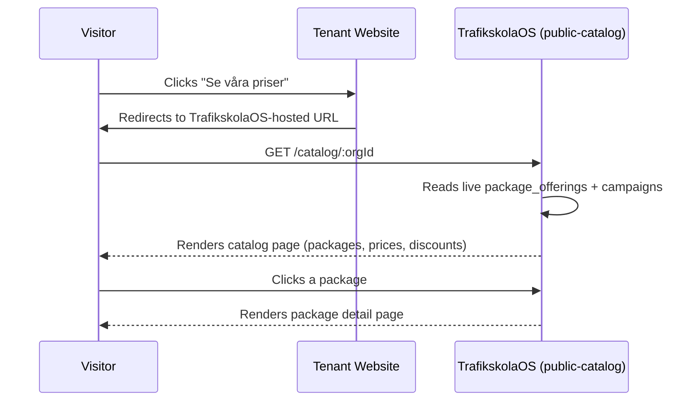
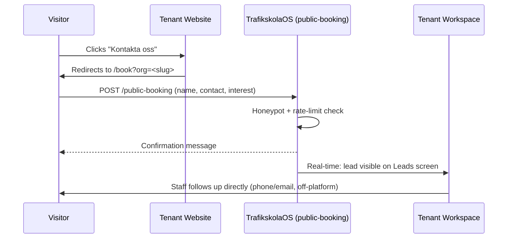
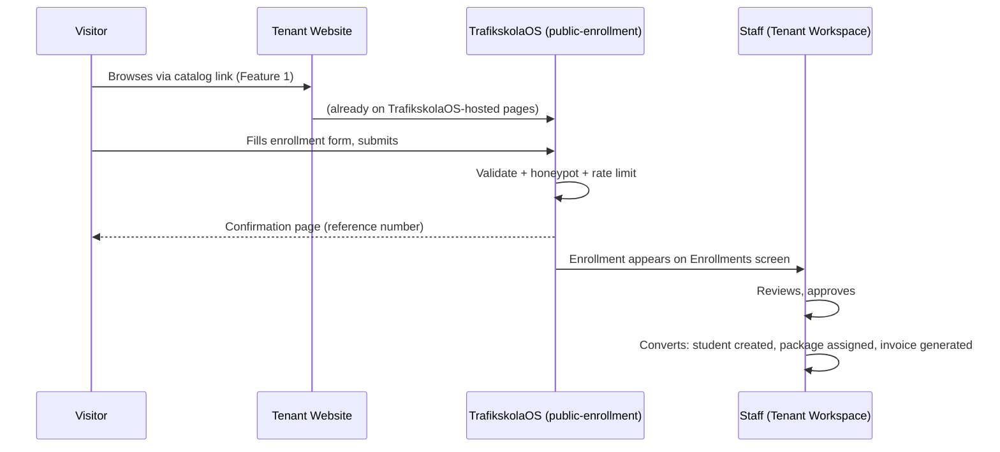
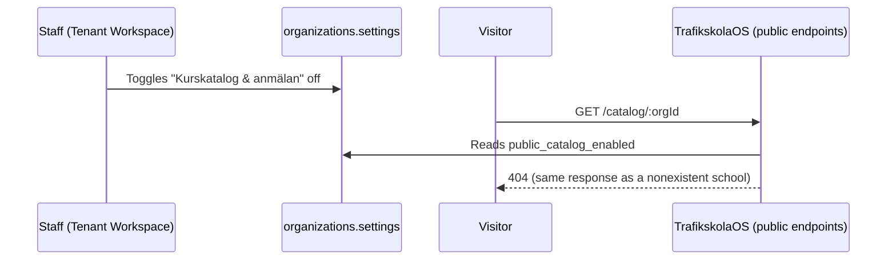
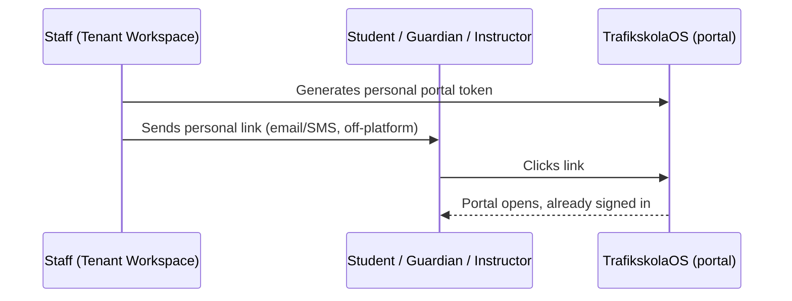

# TrafikskolaOS — Website Feature Integration Catalogue

**Document type:** Implementation documentation. Describes exactly how a driving school's own website can integrate with TrafikskolaOS, feature by feature, as the platform exists today — not as planned or proposed. Every claim below was verified directly against the current codebase; nothing is asserted from memory or convention. Audience: driving schools, the web developers/agencies who build their sites, and platform administrators supporting them.

**Domain boundary:** this catalogue covers a *driving school's own* customer-facing website integrating with TrafikskolaOS. It does not cover TrafikskolaOS's own marketing website (which sells the platform to driving schools) — that is a separate system, out of scope here.

---

## Quick Reference

| Feature | Integration Method | Status |
|---|---|---|
| Public Course Catalogue & Lesson Packages | Link → hosted page | Implemented |
| Public Booking / Lead Capture (Contact Form) | Link → hosted page | Implemented |
| Student Registration & Enrollment | Link → hosted page | Implemented |
| Tenant Public Visibility Configuration | Tenant admin setting | Implemented |
| Customer Portal Entry Points (Student / Guardian / Instructor) | Link (token-based) | Implemented |
| Tenant Branding on Public Pages | — | **Not Implemented** (name only; no logo, color, or content customization) |
| Embeddable Widget / iframe | — | **Not Implemented** (link-out only) |
| "Demo Booking" on a tenant's own website | — | **Not Implemented** (a same-named capability exists, but serves TrafikskolaOS's own prospective-tenant sales funnel, not a driving school's customers — see Feature 8) |

---

## Feature 1 — Public Course Catalogue & Lesson Packages

### 1. Feature Overview
A live, hosted page listing a driving school's lesson packages — name, description, price (incl. VAT), and any active campaign discount — read directly from the school's own live pricing data at the moment a visitor loads the page.

### 2. Business Purpose
Lets a prospective student see real, current pricing without calling or emailing the school, and gives the school a page to link to from anywhere on their own site ("Se våra priser," "Boka nu").

### 3. Visitor Experience
A visitor lands on a clean, package-grid page showing each package's price, any active discount badge, and a "featured" highlight where the school has marked one. Clicking a package opens its own detail page with the full description and any linked campaigns.

### 4. Integration Method
**Link → hosted page.** The driving school places a link or button on their own website pointing to a TrafikskolaOS-hosted URL. The page itself is rendered and served entirely by TrafikskolaOS — nothing is embedded into the school's own page.

### 5. Required Tenant Configuration
- At least one package with `status = active` and `visibility` set to `website` or `public` (configured by staff in the Packages section of the tenant workspace).
- The public catalog must not be disabled (see Feature 4).

### 6. Website Placement Recommendations
A prominent primary call-to-action ("Se våra kurser," "Priser") in the site's main navigation or hero section, linking to the catalog URL below.

### 7. End-to-End Customer Journey
Visitor clicks the link on the school's site → lands on the TrafikskolaOS-hosted catalog → browses packages and any active campaigns → clicks a package for detail → proceeds to Feature 3 (Student Registration) to enroll.

### 8. Branding Behaviour
The page title and meta description are dynamically generated from the school's own name (e.g., "Paket & kurser — Mia Trafikskola"). No logo, color theme, or custom page content is applied — every school's catalog page looks visually identical apart from the name and the packages themselves.

### 9. Security Considerations
Public, unauthenticated, rate-limited (IP-based) endpoint. Only packages explicitly marked `website`/`public` visibility are ever returned — internal-only packages are never exposed. The organization object returned to the browser is limited to `id`, `name`, and `subscription_status` — no settings, contact details, or internal data are included in the response.

### 10. Technical Implementation
- **Edge Function:** `public-catalog` (`GET /public-catalog?org_id=<uuid>`, `GET /public-catalog/<package_id>?org_id=<uuid>`) — unauthenticated, `verify_jwt: false`.
- **Hosted pages:** `/catalog/:orgId` (list), `/catalog/:orgId/:packageId` (detail) — `apps/web/src/modules/public-catalog`.
- **Data source:** `package_offerings` and `campaigns`/`campaign_package_links`, read live — no caching layer, no data duplication.

### 11. Current Implementation Status
**Implemented.** Live-commissioned this engagement, including tenant-visibility gating and correct exclusion of non-public packages.

### 12. Known Limitations
No embeddable version exists — a visitor is always taken to a TrafikskolaOS-hosted page, never shown the catalog inline on the school's own site. No branding customization (logo, colors). No FAQ, reviews, or other marketing content alongside the packages.

---

## Feature 2 — Public Booking / Lead Capture (Contact Form)

### 1. Feature Overview
A lightweight, standalone contact/interest form — name, contact info, license category of interest, optional message — for a visitor who wants to be contacted rather than enroll immediately.

### 2. Business Purpose
Captures early-stage interest with minimal friction, for a visitor not yet ready to browse packages or commit to enrollment.

### 3. Visitor Experience
A short, single-page form. On submission, a clear confirmation message ("Tack för din anmälan! [School] återkommer till dig") — no account, no payment, no further steps from the visitor's side.

### 4. Integration Method
**Link → hosted page.**

### 5. Required Tenant Configuration
- The school's `slug` must be known and used in the link.
- Public booking must be enabled (`settings.public_booking_enabled`, default enabled) — a tenant-facing on/off control exists for this specifically (see Feature 4).

### 6. Website Placement Recommendations
A secondary "Kontakta oss" / "Fråga oss" call-to-action, positioned as a lower-commitment alternative to the full catalog/enrollment flow — e.g., in a footer or a "not sure yet?" section.

### 7. End-to-End Customer Journey
Visitor clicks the contact link on the school's site → lands on the hosted form → submits name + contact info + interest → lead appears immediately on the school's own Leads screen in the tenant workspace → staff follows up directly (phone/email), outside the platform.

### 8. Branding Behaviour
Same as Feature 1 — the school's name and a first-letter avatar are shown; no logo or custom styling.

### 9. Security Considerations
Public, unauthenticated, rate-limited. Protected by a honeypot field (a hidden input real visitors never see or fill; a bot that fills every field on the form trips it) — a tripped submission is met with the same generic error a real transient failure would produce, so a bot gets no distinct "spam blocked" signal, and a legitimate visitor accidentally caught by aggressive browser autofill sees a real, visible error rather than a false success. Nothing is persisted for a honeypot-triggered submission.

### 10. Technical Implementation
- **Edge Function:** `public-booking` (`GET /public-booking?slug=<slug>`, `POST /public-booking`) — unauthenticated, `verify_jwt: false`.
- **Hosted page:** `/book?org=<slug>` — `apps/web/src/modules/leads/routes/PublicBookingPage.tsx`.
- **Data destination:** `student_leads` table, visible on the tenant workspace's Leads screen.

### 11. Current Implementation Status
**Implemented**, including the tenant-facing enable/disable control and honeypot spam protection, both live-verified this engagement.

### 12. Known Limitations
No embeddable version. No automatic staff notification when a new lead arrives (a staff member must check the Leads screen).

---

## Feature 3 — Student Registration & Enrollment

### 1. Feature Overview
A structured sign-up form tied to a specific package — collects the applicant's details, applies any coupon code, and creates a real, staff-reviewable enrollment record.

### 2. Business Purpose
Converts an interested visitor into a formal applicant without a phone call, while keeping a human review step before the applicant becomes a student.

### 3. Visitor Experience
Visitor selects a package, sees the price (with any coupon applied live), fills in their details, and submits. They are told plainly that no payment happens at this step and the school will be in touch to confirm and arrange payment — the confirmation page repeats this.

### 4. Integration Method
**Link → hosted page**, reached from Feature 1's package detail page ("Anmäl dig").

### 5. Required Tenant Configuration
Same package-visibility requirement as Feature 1 (enrollment always requires an active, publicly visible package); public catalog/enrollment must be enabled (Feature 4).

### 6. End-to-End Customer Journey
Visitor browses the catalog (Feature 1) → selects a package → fills in the enrollment form, optionally applies a coupon → submits → real-time confirmation page with a reference number → **staff-side:** the submission appears on the Enrollments screen, is reviewed, approved or rejected, and — on approval — converted into a real student record with the package automatically assigned, an order created, and an invoice generated automatically.

### 7. Website Placement Recommendations
Reached via Feature 1's catalog, not linked independently — the natural next step from browsing packages, not a separate top-level navigation item.

### 8. Branding Behaviour
Same as Feature 1.

### 9. Security Considerations
Same honeypot and rate-limiting protection as Feature 2 (per-email limit: 3 submissions/hour), plus: rejects submissions for a suspended or deleted organization, and for a package that is no longer active or public — both live-verified. Coupon/campaign validity and price are always recomputed server-side, never trusted from the client.

### 10. Technical Implementation
- **Edge Function:** `public-enrollment` (`POST /public-enrollment?org_id=<uuid>`, `GET /public-enrollment/validate-coupon`) — unauthenticated, `verify_jwt: false`.
- **Hosted pages:** `/catalog/:orgId/:packageId/checkout`, `/catalog/:orgId/:packageId/confirmation`.
- **Staff-side:** `enrollments` Edge Function and workspace screen — approve/reject/convert, with duplicate-applicant detection (by email/phone/personnummer) shown as a non-blocking warning.
- **Downstream automation on conversion:** student record created (or matched to an existing one), package assigned, order created, invoice generated — automatically, in one step.

### 11. Current Implementation Status
**Implemented and live-commissioned end to end**, including the full submit → approve → convert → invoice chain, verified with real data during this engagement.

### 12. Known Limitations
No online payment at the point of enrollment — payment is always arranged afterward, off this flow. No capture of guardian information for applicants who are minors (a real consideration given Swedish moped/motorcycle licenses are available from age 15–16) — this is a known, currently unresolved item pending a product-owner scope decision, not yet built either way.

---

## Feature 4 — Tenant Public Visibility Configuration

### 1. Feature Overview
Tenant-facing on/off switches controlling whether the school's public catalog/enrollment and public contact form are reachable at all.

### 2. Business Purpose
Lets a school temporarily take its public storefront offline (e.g., fully booked for the season) without needing to unpublish every package individually, or without contacting support.

### 3. Visitor Experience
When disabled, the catalog/enrollment pages return the same "not found" response as a genuinely nonexistent school (deliberately not distinguishable, to avoid revealing a school's operational status to an outside observer); the contact form instead shows a clear "temporarily closed" message.

### 4. Integration Method
**Tenant admin setting** — not a visitor-facing integration itself, but the control that governs Features 1–3's availability.

### 5. Required Tenant Configuration
None — enabled by default; a tenant administrator with the right permission toggles it off/on as needed.

### 6. Website Placement Recommendations
Not applicable (an internal tenant workspace setting, not something placed on the public website).

### 7. End-to-End Customer Journey
Not applicable to a visitor directly — this feature shapes whether Features 1–3's journeys are reachable at all.

### 8. Branding Behaviour
Not applicable.

### 9. Security Considerations
The switch is read server-side on every public request — there is no cached or stale state a visitor could exploit to bypass a disabled setting.

### 10. Technical Implementation
- **Setting:** `organizations.settings.public_catalog_enabled` (governs Features 1 & 3 together) and `settings.public_booking_enabled` (governs Feature 2 independently) — both default `true` unless explicitly set to `false`.
- **Admin UI:** "Publik webbnärvaro" section, Company Settings — `apps/web/src/modules/settings/routes/CompanySettingsPage.tsx`, showing each toggle alongside its own live public URL.
- **Enforcement:** checked directly in `public-catalog`, `public-enrollment`, and `public-booking` on every request.

### 11. Current Implementation Status
**Implemented and live-verified** — both flags tested live in both states (enabled/disabled) against all three affected endpoints during this engagement.

### 12. Known Limitations
Catalog and enrollment share a single switch — a school cannot disable new enrollments while keeping the catalog browsable (e.g., "fully booked, but still show our prices"). This is a known, deliberate simplification pending a product-owner decision on whether finer-grained control is warranted.

---

## Feature 5 — Customer Portal Entry Points (Student / Guardian / Instructor)

### 1. Feature Overview
Dedicated, ongoing self-service areas for people who are already customers — students track bookings/progress/documents, guardians oversee a minor's enrollment, instructors manage their own schedule.

### 2. Business Purpose
Lets existing customers self-serve (view bookings, check package balance, message the school) without calling in, reducing reception workload.

### 3. Visitor Experience
Reached via a personal link (sent by the school, e.g. by email or SMS) rather than a username/password — clicking it opens the relevant portal directly, already signed in.

### 4. Integration Method
**Link only, deliberately never embedded.** A driving school can place a generic "Elevportal" / "Föräldraportal" / "Lärarportal" link in their site navigation, but each individual's actual access is always via their own personal, staff-issued link — a portal session is never embedded inside the school's own page.

### 5. Required Tenant Configuration
None beyond normal staff use of the platform (generating and sending a portal link per person, from the relevant record in the tenant workspace).

### 6. Website Placement Recommendations
A simple "Logga in" / "Elevportal" link in the site's header or footer, pointing visitors to request their personal link from the school if they don't already have one.

### 7. End-to-End Customer Journey
Staff generates a personal token-based link for a student/guardian/instructor → sends it to them directly → recipient clicks it → lands signed-in on their own portal.

### 8. Branding Behaviour
Same as other hosted pages — school name shown, no further customization.

### 9. Security Considerations
Authenticated self-service is a hard architectural boundary from the public pages above: a portal session is never embeddable in a third-party page (preventing clickjacking/session-integrity risk from a page TrafikskolaOS doesn't control) — link-out only, by design, with no exception found anywhere in the current implementation.

### 10. Technical Implementation
- **Edge Functions:** `student-portal`, `guardian-portal`, `instructor-portal` / `instructor-app` — each `verify_jwt: false`, using their own possession-based token session model (distinct from staff Supabase Auth JWTs).
- **Token issuance:** staff-facing `generate-token`-style routes, permission-gated.

### 11. Current Implementation Status
**Implemented** — all three portals are real, working, and were exercised live (student portal specifically) during this engagement.

### 12. Known Limitations
Three separate entry points/links to maintain rather than one unified "Logga in" that disambiguates by role — a known, previously identified simplification opportunity, not yet built.

---

## Feature 6 — Tenant Branding on Public Pages

### 1. Feature Overview
The extent to which a driving school's own visual identity appears on the TrafikskolaOS-hosted public pages (Features 1–3).

### 2–8. (Combined — this feature is Not Implemented)

Verified directly: the hosted catalog, checkout, confirmation, and booking pages render only the school's plain-text `name` (page titles, headings, a first-letter avatar circle). No logo upload, no color/theme customization, and no custom page content exist anywhere in the current implementation — every school's public pages are visually identical apart from their name and their own packages/pricing.

### 9. Security Considerations
Not applicable — no user-supplied branding content exists to sanitize or abuse.

### 10. Technical Implementation
Not applicable — no such capability exists in the codebase to describe.

### 11. Current Implementation Status
**Not Implemented.**

### 12. Known Limitations
A driving school cannot currently make the hosted pages look like "their own" beyond the name shown.

---

## Feature 7 — Embeddable Widget / iframe Integration

### 1. Feature Overview
The ability to embed TrafikskolaOS content (catalog, booking, enrollment) directly inside a driving school's own page, rather than sending the visitor to a separate, TrafikskolaOS-hosted page.

### 2–10. (Combined — this feature is Not Implemented)

No embeddable widget, JavaScript snippet, or iframe-ready integration exists anywhere in the current implementation. Every integration described in Features 1–3 works exclusively via a full-page redirect/link — a visitor always visibly leaves the school's own site to reach a TrafikskolaOS-hosted URL.

### 11. Current Implementation Status
**Not Implemented.**

### 12. Known Limitations
A driving school cannot currently present TrafikskolaOS content as though it were a native part of their own page.

---

## Feature 8 — "Demo Booking" (Naming Clarification)

### 1. Feature Overview
A capability named "demo request/booking" does exist in the codebase, but it is **not** a tenant-website-facing feature — it is TrafikskolaOS's own prospective-customer sales flow ("Boka en personlig visning" on TrafikskolaOS's own marketing site), for a driving school considering *becoming* a TrafikskolaOS customer.

### 2–10. Not applicable to this catalogue's scope — this capability belongs to TrafikskolaOS's own marketing website, not to any driving school's website integration.

### 11. Current Implementation Status
**Not Implemented** in the sense this catalogue's readers would expect (e.g., "let a prospective student book a trial lesson from our website") — no such end-customer-facing trial/demo-lesson booking capability exists anywhere in the current implementation.

### 12. Known Limitations
Readers should not confuse the existing `demo-requests` capability (TrafikskolaOS-facing) with a driving-school-website-facing "book a trial lesson" feature — the latter does not exist.

---

## Summary — Implemented vs. Not Implemented

**Implemented, link-based, ready to place on a driving school's own website today:** Public Course Catalogue & Lesson Packages, Public Booking/Lead Capture, Student Registration & Enrollment, Customer Portal Entry Points. All governed by the tenant-controlled visibility switches in Feature 4.

**Not Implemented — do not represent these as available to a driving school today:** Tenant branding/theming of public pages, embeddable widget/iframe integration, an end-customer-facing trial/demo-lesson booking feature.
